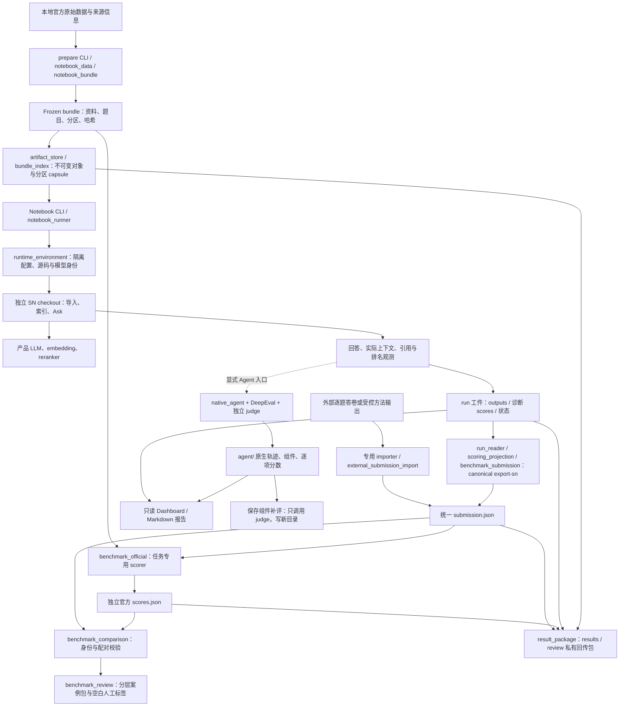

# Silicon Notebook 评测项目：当前架构

核实日期：2026-10-08。工作树：`feat/benchmark-protocol-correctness`；本文同步当前共享工件、reader、compact 导出和打包实现。执行时仍须记录实际提交与未提交源码身份。

本文解释 **benchmark-deepeval 评测仓库目前怎样工作、数据由谁负责、修改会影响哪里**。安装与命令见 [RUNBOOK.md](RUNBOOK.md)，benchmark 评分定义见[标准与实现符合性](docs/notebook-benchmark-standards-and-conformance.md)。本文描述当前代码，不是目标架构或重构方案，也不展开 SN 产品自身的完整架构。

核对依据为本地代码、测试用例、Git 历史及已有项目文档。未查询服务器、远程 Git、客户使用量或收入数据；历史验收记录不能自动视为当前部署事实。本机不执行真实 SN／模型实验，当前服务器计划仍是 SN-only。

**2026-09-29 仓内已收敛为 QASPER、MultiHop-RAG、ALCE、QMSum、HotpotQA。** 旧套件专属路径已删除，共用职责已迁出，没有旧模块转发壳。实际删除见 [DELETION_LOG](DELETION_LOG.md)，五套内部仍待处理的版本默认／兼容见 [TRIAGE](TRIAGE.md)。

## 1. 系统定位与边界

这是以 **CLI 和文件工件为中心的评测工具集**。核心职责是把公开数据转成可追溯输入，调用被测系统，保存回答与过程观测，再分别计算官方任务成绩、Agent 过程分和诊断报告。

| 边界 | 当前职责 |
| --- | --- |
| 本仓库 | 数据适配、冻结与校验；运行隔离；调用与观测；证据投影；评分、比较、报告 |
| 独立 SN checkout | 真正的资料导入、解析、分块、embedding、检索、意图判断、reasoning 和答案生成；数据库业务实现 |
| 模型服务／本地权重 | SN 生成与检索组件；独立 judge；官方 scorer 使用的模型，三者分别配置和记录 |
| 服务器执行者 | 填写真实路径、冻结环境、展开 partition 任务、控制 smoke/full、维护 campaign 总账、回传工件 |
| 人工复核者 | 判读案例、填写人工标签、判断科学结论；代码生成的复核包不等于已经完成的人评 |

主评测链不是 HTTP 压测：runner 在 Python 进程中导入 SN，调用 `SQLiteRepository` 的业务方法。它覆盖业务逻辑，但不据此证明 Web UI、HTTP 鉴权、多用户并发或生产部署正确。

这里有两个独立的模型评估维度：**官方 benchmark 评分**判断任务答案／证据是否正确；**DeepEval 原生评测**判断真实组件和 Agent 轨迹的表现。二者共用原始运行证据，但没有合成一个总分。

## 2. 总体数据流

图中的外部方法和 Agent 评测表示代码能力，不表示当前 SN-only campaign 会运行它们。Dashboard 目前围绕保存的 run 工作；**不能把官方 `submission.json`／`scores.json` 或独立组件补评目录直接当作 run 丢进去**。正式答卷比较由独立比较 CLI 完成，尚无统一覆盖所有产物的实验管理服务。

## 3. 入口在哪里

### 3.1 当前主要 CLI

| 入口 | 后续主要模块 | 输入 → 输出 |
| --- | --- | --- |
| [`prepare_notebook_benchmarks.py`](scripts/prepare_notebook_benchmarks.py) | `notebook_data`、`notebook_bundle`、`bundle_index` | 本地数据 → frozen bundle；`--artifact-root` 安装共享对象，`--install-bundle` 安装已有 bundle；不下载 |
| [`run_notebook_benchmarks.py`](scripts/run_notebook_benchmarks.py) | `notebook_runner` | 一个 bundle 的一个 partition、一个 mode → 新 run；调用 SN 模型 |
| [`run_notebook_agent.py`](scripts/run_notebook_agent.py) | 同一 runner，加 `native_agent` | 同上，加 judge／指标选择 → 回答和原生评测工件 |
| [`benchmark_protocol.py`](scripts/benchmark_protocol.py) | `benchmark_submission`、`benchmark_official`、`external_submission_import` | scorer 获取、SN 导出、外部导入、官方评分的子命令；只有 `fetch-sources` 下载固定 scorer |
| [`validate_external_campaign.py`](scripts/validate_external_campaign.py) | 登记表、scope、执行计划校验 | JSON/JSONL 模板和可选 bundle 题单 → 预检报告；不是调度器 |
| [`compare_benchmark_submissions.py`](scripts/compare_benchmark_submissions.py) | `benchmark_comparison` | 多份 submission＋对应 scores＋同源 bundle → 配对比较报告 |
| [`review_benchmark_comparison.py`](scripts/review_benchmark_comparison.py) | `benchmark_review` | 经验证比较报告 → 可复现案例抽样、任务汇总、空白标注文件 |
| [`score_native_components.py`](scripts/score_native_components.py) | `native_component_scoring` | 保存的完整组件样本 → 新补评批次；只调用 judge |
| [`rescore_notebook_run.py`](scripts/rescore_notebook_run.py) | `notebook_rescoring` | 已有 Notebook 回答 → 新的运行期评分批次；区别于官方 submission 评分 |
| [`build_experiment_dashboard.py`](scripts/build_experiment_dashboard.py) | `experiment_aggregation`、`explorer_artifacts` | 已有 run → 静态报告目录；不启动模型 |
| [`package_benchmark_results.py`](scripts/package_benchmark_results.py) | `result_package` | campaign → results/review 私有包、逐文件哈希、inventory 与收据；不删除原始工件 |

五套 Notebook 数据集为 QASPER、MultiHop-RAG、ALCE、QMSum、HotpotQA，ALCE 分为 ASQA/QAMPARI/ELI5。当前 SN-only 计划有 6 个 method、12 条 smoke/full 模板行；ALCE task 和各 partition 还需展开，模板行不是最终进程数。

### 3.2 参考方法、外部方法与通用工具

| 路径 | 当前地位 |
| --- | --- |
| [`run_benchmark_reference.py`](scripts/run_benchmark_reference.py) | 通用 BM25、full-context、ALCE candidate-topk 项目控制组；输出统一答卷，不代表作者方法复现 |
| [`run_lab_qasper.py`](scripts/run_lab_qasper.py)、[`run_kg2rag.py`](scripts/run_kg2rag.py)、[`run_alce_vanilla.py`](scripts/run_alce_vanilla.py) | 作者代码／适配方法的受控入口；具体改动和服务器未验收部分见[外部方法记录](docs/notebook-external-results-2026-09-28.md) |
| [`import_multimeta_predictions.py`](scripts/import_multimeta_predictions.py)、[`import_alce_human_predictions.py`](scripts/import_alce_human_predictions.py)、[`import_qmsum_socratic_predictions.py`](scripts/import_qmsum_socratic_predictions.py)、[`import_hotpot_predictions.py`](scripts/import_hotpot_predictions.py) | 显式导入已有答卷并保留来源／题目映射；导入不等于在当前机器复现生成 |
| [`run_notebook_baseline.py`](scripts/run_notebook_baseline.py) | 较早的 QMSum 单会议 BM25 路径及其 run 格式仍保留；不能与通用 reference 入口按名字混同 |
| [`run_project_retrieval.py`](scripts/run_project_retrieval.py) | 通用 SN 检索诊断；不是 MultiHop 官方检索成绩入口 |
| `rag-eval-deepeval` | [`pyproject.toml`](pyproject.toml) 注册的通用 RAG DeepEval 评分入口；不是 Notebook 的统一总入口 |
| [`evaluate_agent_traces.py`](scripts/evaluate_agent_traces.py)、[`agent_dag.py`](src/rag_eval/agent_dag.py) | 前者仅保留确定性历史诊断，后者有 DAG 构造代码；存在文件不等于已接入当前原生 Agent 正式评分 |

### 3.3 页面、API、定时任务与消费者

- **页面**：Dashboard 是生成后的 `dashboard.html` 加 `details/` 静态文件；页面逻辑在 [`src/rag_eval/dashboard/`](src/rag_eval/dashboard/)。没有 evaluator 后端 API，按钮不会触发模型或重评分。
- **API**：本仓库主路径无 FastAPI/Flask HTTP 服务入口；SN 的 Python 业务接口属于外部产品依赖。SN 自身的 HTTP 服务不由这里部署。
- **定时任务**：仓内旧 benchmark 的 service／timer 模板和自动化入口已删除。当前五套没有常驻调度器，campaign 由服务器执行者展开。既有服务器部署未查询或启停。
- **消息消费者**：当前扫描的 evaluator 源码、scripts 和部署模板未发现 Kafka/RabbitMQ/Celery 消费入口。没有依赖共享消息队列的 Notebook 作业系统。

## 4. 主要模块如何协作

| 模块组 | 负责的保证 | 主要消费者／变更影响 |
| --- | --- | --- |
| [`notebook_data.py`](src/rag_eval/notebook_data.py)、[`notebook_bundle.py`](src/rag_eval/notebook_bundle.py) | 官方数据适配、公共资料与 gold 分离、稳定 case/group/partition 标识、资料完整性、冻结重建校验 | SN、reference、import/export、评分、比较、报告；改动影响实验身份，不只是读取格式 |
| [`artifact_store.py`](src/rag_eval/artifact_store.py)、[`bundle_index.py`](src/rag_eval/bundle_index.py) | 不可变对象安装、内容哈希／引用、并发发布、完整 canonical 安装与分区 capsule | runner、派生评分和回传；不拥有可变数据库，不改变资料范围 |
| [`notebook_runner.py`](src/rag_eval/notebook_runner.py) | 一次一个 partition/mode；执行顺序、题单、输出、诊断分、失败状态与来源身份 | 普通 Notebook 和 Agent CLI 共用；这里决定 run 的生命周期 |
| [`runtime_environment.py`](src/rag_eval/runtime_environment.py) | 源码快照、SN 环境隔离、固定模型配置、显式 judge 解析 | Notebook、reference、独立 judge／组件补评复用；职责已从旧入口分离 |
| [`benchmark_runtime.py`](src/rag_eval/benchmark_runtime.py)、[`system_runtime.py`](src/rag_eval/system_runtime.py) | 创建 notebook、导入资料、校验 embedding、建索引；意图预览、Ask、持久化确认与产品状态 | 与 SN 私有仓储／业务接口耦合；Notebook 复用其中的函数，不会调用每个历史入口 |
| [`system_capture.py`](src/rag_eval/system_capture.py)、[`usage_capture.py`](src/rag_eval/usage_capture.py)、[`sn_retrieval.py`](src/rag_eval/sn_retrieval.py) | 保存真实合成上下文、可观察成本和 MultiHop chunk 实际选段排名 | 原始工件、证据投影、成本报告；不从结果倒推不存在的调用 |
| [`qasper_evidence.py`](src/rag_eval/qasper_evidence.py)、[`hotpot_evidence.py`](src/rag_eval/hotpot_evidence.py) | 最终引用到原论文段落／Hotpot 原句位置的显式投影及快照回放 | Evidence／Supporting Fact／Joint 指标；候选上下文覆盖不能替代预测 |
| [`native_agent.py`](src/rag_eval/native_agent.py)、[`native_metrics.py`](src/rag_eval/native_metrics.py)、[`native_sdk.py`](src/rag_eval/native_sdk.py) | 真实 SN span 接入固定 SDK、适用性、逐指标 checkpoint、完整轨迹和组件边界 | DeepEval judge、Agent 工件、后续组件补评 |
| [`benchmark_submission.py`](src/rag_eval/benchmark_submission.py)、[`scoring_projection.py`](src/rag_eval/scoring_projection.py)、[`external_submission_import.py`](src/rag_eval/external_submission_import.py) | 显式答卷身份；验证原观测后投影必要字段，保留 missing/error、完整证据快照与来源 run/hash | 官方 scorer 与比较器；compact 交换格式不替代审计 run |
| [`benchmark_official.py`](src/rag_eval/benchmark_official.py) 及各 suite scorer | 准备评分输入、固定算法／依赖身份、聚合规则、实际分母和 pending | `scores.json`、比较报告；独立于 run 内的诊断分 |
| [`benchmark_comparison.py`](src/rag_eval/benchmark_comparison.py)、[`benchmark_review.py`](src/rag_eval/benchmark_review.py) | 同范围、同 scorer、逐题资格和配对；适用的 group bootstrap；复核材料 | 正式比较、论文分析；不自动证明生成模型一致或单变量因果关系 |
| [`identity.py`](src/rag_eval/identity.py)、[`trace_contract.py`](src/rag_eval/trace_contract.py)、[`run_support.py`](src/rag_eval/run_support.py)、[`model_adapter.py`](src/rag_eval/model_adapter.py) | 稳定身份哈希、诚实 trace 完整度、状态／引用对象诊断、显式模型调用与事件 | 五套执行、Agent、reference、补评；旧套件分支与旧模块导入已删除 |
| [`run_reader.py`](src/rag_eval/run_reader.py)、[`run_report.py`](src/rag_eval/run_report.py)、[`run_results.py`](src/rag_eval/run_results.py)、[`artifacts.py`](src/rag_eval/artifacts.py) | reader 校验输入／计划／观测，调用内 context 复用；report 生成展示，journal 逐条落盘 | 默认 canonical 全验证；共享运行自动单 run 报告显式只校验 capsule，不作为官方导出审计 |
| [`result_package.py`](src/rag_eval/result_package.py) | 只读角色清单、results/review 包、依赖去重、字节／耗时／hash 收据 | 服务器回传；排除 runtime/配置/原始服务日志，不提供删除策略 |
| [`experiment_aggregation.py`](src/rag_eval/experiment_aggregation.py)、[`explorer_artifacts.py`](src/rag_eval/explorer_artifacts.py)、[`explorer_steps.py`](src/rag_eval/explorer_steps.py) | 只读工件变成实验关系、逐题详情与页面数据 | 静态前端，不是另一套实验执行或评分引擎 |

官方评分桥接并非一种统一调用形式：QASPER/MultiHop 等复用固定作者源码中的评分逻辑；Hotpot 在本仓库有经原版校准的实现；QMSum 启动 Perl ROUGE 子进程；ALCE 区分轻量文本逻辑和显式原版模型评分子进程。具体等价性、适配差异及尚未验证项由标准文档逐 suite 说明。

## 5. 核心数据在哪里，谁是权威来源

本仓库没有集中保存所有实验的 evaluator 数据库。主要记录是文件，SN 隔离数据库服务于一次产品调用流程；配置哈希与账本用于连接输入、运行、评分和报告。

| 数据层 | 典型位置／文件 | 权威来源与使用规则 |
| --- | --- | --- |
| 执行意图 | `configs/notebook-external-*.json`、execution-plan JSONL、`configs/comparison-scopes/` | 仓库模板只说明计划；服务器实际 SHA、路径和状态需另记 campaign manifest／账本 |
| 冻结数据 | bundle 的 `raw-data`、可选 `raw-corpus`、`source.json`、`documents.jsonl`、`cases.jsonl`、`partitions.jsonl`、`decisions.jsonl`、`manifest.json` | 原始字节和来源决定适配结果；load 时核哈希并重建对照。gold 留在评测侧，生成请求只取公共字段 |
| 执行身份 | run 的 `manifest.json`、`source-identity.json`、`runtime-identity.json`；共享 `artifact-refs.json` 指向 evaluator/SN 对象，旧 run 保留 `source/`、`product-source.tar` | 实际源码／archive 字节、依赖与配置身份；manifest 绑定共享对象集合，目录名不能证明同一实验 |
| 执行输入与计划 | 新共享 run 的 `artifact-refs.json`、store bundle/index/capsule；旧 run 的 `input/`；每个 run 的 `product-bundle.json`、`planned.jsonl` | frozen bundle 一份、派生 capsule 与官方 bundle 身份分开；product-bundle 是分区完整无 gold 输入，planned 说明预期评分条目 |
| 原始回答和状态 | `outputs.jsonl`、`state.json`、`product-artifacts/attempts.jsonl` | 回答事实与运行阶段；原始输出不被 judge 成败或后续重评分覆盖 |
| SN 数据库、文件与缓存 | `run/runtime/database.db`、`storage/`、模型配置副本、日志及相关索引 | `SQLiteRepository` 拥有产品表与持久化逻辑；路径隔离由 evaluator 设置。LLM 缓存开关被关闭，不是跨 run 共享答案池 |
| 产品对象映射 | `product-artifacts/document-map.json` 等 | 将公开 document ID 对应到真实 source/chunk ID；证据投影依赖可验证的归属与原文位置 |
| 运行期诊断分 | `run/scores.jsonl` | 按 `planned.jsonl` 保存诊断评分状态；不是下面的统一官方 scores |
| Agent 原生工件 | `agent/components.jsonl`、`native-traces.jsonl`、`native-scores.jsonl`、events/diagnostics/summary、`agent/sdk/` | request/span/sample/metric ID 关联真实调用；不同快照／组件调用不增加题目数 |
| 官方答卷与成绩 | `submissions/<job>/submission.json`；`official-scores/<job>/` 的 `prepared.json`、答卷副本、bundle manifest、`scores.json` 及 scorer 特定工件 | SN compact submission 声明投影协议、run_id/outputs hash；保持原评分输入与分母，不含无关完整 product_record |
| 补评批次 | `component-score-manifest.json`、`component-scores.jsonl` 等，或 Notebook rescoring run | 原始样本只读，新评分拥有独立批次和 judge/scorer 身份；不伪装成新一次 Ask |
| 派生展示 | comparison `report.json/.md`，review `review.json/.md`、`annotations.jsonl`，Dashboard HTML/JSON/`details/` | 能追溯到输入工件；截图、Markdown 或页面均不替代原始证据 |
| 回传包 | `package-manifest.json`、`inventory.json`、archive、相邻 receipt；review 的共享依赖与必要完整 observations | 角色 allowlist 与逐文件 hash；results 包不是完整 run，review 包也不自动授予 runtime 删除资格 |

文件通常放在执行机器的 `var/` 或显式外部路径。`.gitignore` 排除大部分 `var/**`、虚拟环境、数据库及部分原始数据，Git 中的 `results/` 只承载选择保存的材料；**clone 不会恢复历史实验**。上传包位于仓库外，也是独立交付物，不能从“代码已推送”推断它同步更新。

`save_json/save_jsonl` 用临时文件替换发布完整文件；`EventJournal` 独占创建并逐条 flush/fsync，锁限定在单进程线程间。二者不是跨文件数据库事务；不能让多个进程向同一个 run 写入，也不能承诺机器断电后全部文件处于同一时刻。报告读取器披露未完成 JSONL 尾行，身份或中间内容损坏则拒绝。

原始 bundle 含 gold，runtime 可能含模型配置和原始日志，组件可能含全部上下文。生成隔离与对外脱敏是不同边界：结构化字段脱敏不等于任意自由文本都已完成隐私检查。

## 6. 一次执行实际经过什么

### 6.1 例子：QMSum 某会议中的一个问题

1. `prepare` 从本地正式来源生成 bundle；同一会议的问题共享完整会议资料和一个 partition。选择一题只限制提问，不删会议内容。
2. 先以 `prepare --install-bundle ... --artifact-root ...` 完整安装 canonical bundle，冻结 installer 输出的 bundle/index ID；Notebook CLI 显式传 `notebook-request-v3`、`--artifact-root` 和来自冻结配置的 `--artifact-index-id`，拒绝 pointer 变化，再校验 capsule、完整公开请求与选题归属。未指定 store 的旧复制模式仍完整加载 bundle。
3. runner 拒绝已有 run-dir，发布共享输入／源码引用并调用 `configure_environment`；无 store 时仍复制 `input/`。配置、数据库和 storage 始终独立。环境变量、导入路径和 cwd 会变化，因此一个分区/mode 使用一个新 CLI 进程。
4. `prepare_notebook` 通过 SN 导入整份资料，保存对象映射，检查分块和 embedding 覆盖并建索引。被测检索／生成模型由 SN TOML 及对应 Settings 决定。
5. `run_system_question` 捕获实际合成输入及 usage，进入 `submit_system_question`。chunk 直接 Ask；reasoning 先做原生意图预览，需要澄清时记录 clarification，不从 gold 编造澄清回答。
6. Ask 返回后检查 SN 是否实际持久化该答案，记录 success/no_answer/clarification/error。输出完成后接入评分侧标签做诊断；若证据观测失败，保留答案与错误状态，不捏造空证据成功。
7. run 保存完整回答、诊断分和终态；共享模式自动单 run 报告披露 capsule 校验边界。正式 export 显式列真实 run 目录，用一个 context 做 canonical 全验证，按套件 compact 投影并跨分区对账；不能传父目录期待递归发现。
8. QMSum 官方成绩从独立 submission 调用指定的 Perl ROUGE 产生。论文用的官方成绩与 run 内 Python ROUGE 诊断分别留存。

当前 run 状态包括 `initializing`、`importing`、`asking`、`scoring`，终态可能是 `finished`、`finished_with_errors`、`failed`、`interrupted`。一个 run finished 只说明该次调用流程结束，不能证明整个 suite 的所有分区都完成，更不能证明官方评分或比较通过。

输入／源码与答卷生命周期的具体命令、projection 字段、包角色及服务器尚未验证的性能范围见[结果存储与导出](docs/result-storage-and-export.md)。QASPER/Hotpot 的整个 response/captures 参与 evidence observation hash，首版仍原样保留；进一步裁剪必须重新设计证据协议，不能修改 hash 让旧快照通过。

安装已有 bundle 会通过 `load_bundle` 完整哈希并重新适配一次，不重新 prepare 或改写原目录。当前 index 为每个 partition 存 v1/v2/v3 capsule，重复公开资料／请求；bundle object identity 的 `partition_capsules` 文件哈希绑定所选派生字节，reader 还精确核对共享源码与 run code identity。每个 run 仍保存完整 `product-bundle.json`，runtime 不变。QMSum BM25 初始化提取 turns 仍完整哈希并解析 raw data；SN bounded 初始化不能泛化成所有方法的性能承诺。

### 6.2 Agent 观测和评分的附加流程

Agent CLI 复用上述 runner，仅增加显式 `agent_config`。SN 拥有真实 span 的生成与生命周期；evaluator 在公开 SDK 接口上关联 test case、metric 和样本身份。当前组件指标为 contextual_relevancy、faithfulness、answer_relevancy，完整轨迹指标为 task_completion、step_efficiency、plan_quality、plan_adherence。

关键顺序是 **真实调用 → 保存产品回答／组件及评分前轨迹检查点 → judge 评分 → 每项分数立即 checkpoint**。这不是“先把整个 judge 批次跑完，再统一保存答案”。SDK 内部原生调度仍可能先轨迹后组件；服务器分批先评组件是执行计划选择，不是本仓库重排 SDK 的保证。

`--trajectory` 控制完整轨迹评分，不负责开启 reasoning 业务逻辑。缺显式计划的 chunk 不适用计划类指标；观测不完整不能报完整轨迹分。多 query 检索保留各 query/result 映射，不把聚合 span 拆成虚构的业务调用。这里观测的是公开业务计划／动作，不是模型隐藏思维过程。

judge 超时与产品调用失败是不同事实。已完成指标保持落盘；补评只读原组件，写新批次。同步软超时不能撤销已发到远端的计算，代码要阻止过期调用继续和迟到结果覆盖既定终态。当前没有把任意旧 JSON 回灌成真实原生整轨迹的支持路径。

### 6.3 比较与解释

`benchmark_comparison` 重建并校验 submission、prepared inputs、scores 哈希、suite/scope/case IDs 和 scorer 身份，分别处理可逐题指标与 batch-only 指标。错误或不完整答卷不能靠“只比较成功题”变成正式全量比较。

符合条件的逐题指标按共同有效样本配对，group bootstrap 需要足够的 group；例如单 group 不构造伪置信区间，批量指标也不凭空变成逐题分数。成本只使用已观测量，无法观察的 token、HTTP 尝试或费用不补猜。

这些检查保证的是评分和比较工件的技术一致性。**同一个 benchmark、甚至同名生成模型，都不自动证明同模型同预算或单变量因果比较**；当前没有自动完成 SN/reference 模型身份对齐的 gate。控制条件和 adapted/published 等来源类别仍需要运行 manifest 与人工审阅。

## 7. 关键外部依赖

| 依赖 | 被哪些路径使用 | 失败／变更边界 |
| --- | --- | --- |
| Python、setuptools、可选 pytest | 所有 CLI、打包／开发测试 | `pyproject.toml` 要求 Python >=3.11；没有覆盖全部产品/scorer 依赖的统一 lock |
| SN checkout 及 backend 依赖 | Notebook／Agent／部分参考路径，补评复用其模型客户端 | evaluator 依赖 `SQLiteRepository`、配置、Ask、parser/chunker、对象表及观测契约；产品升级必须核对这些接口 |
| DeepEval **4.2.2** | Agent 及保留的 Native/GEval/RAG 路径 | 原生入口显式验证版本；官方确定性 scorer 和静态 Dashboard 不以 DeepEval 为通用计算引擎 |
| 产品模型服务 | 生成模型、意图／改写、embedding、reranker 等实际启用组件 | 服务、模型、tokenizer、采样和预算构成方法身份；配置文件相同也不能证明远端服务没有变化 |
| 独立 judge | Agent、组件补评和部分历史评分轨道 | JSON 配置显式引用端点／凭据环境变量；超窗、客户端时限与网关时限分别保留证据 |
| 官方数据／scorer 源码 | bundle 与正式评分 | 固定来源和哈希；prepare 不下载，fetch-sources 才显式联网获取 scorer |
| Perl ROUGE-1.5.5 | QMSum 正式评分 | 分发文件、Perl 模块、分句 profile 和 batch 聚合共同决定口径；Python ROUGE 不替代 |
| HF 权重缓存、NLTK、Torch/Transformers 等 | ALCE 官方模型评分，部分作者方法 | ALCE bridge 要求预置模型快照并强制离线；缺依赖保留失败／pending，不静默降级替换模型 |
| Git 与本地文件系统 | 源码归档、输入身份、工件持久化 | Git 推送不包含被忽略的运行数据，文件级原子发布不是多文件事务 |
| 浏览器、Node，额外 Playwright/Chromium | 打开 Dashboard；JS/浏览器测试 | 展示无需常驻服务；测试依赖与模型实验依赖分开 |

## 8. 哪些流程有实际价值

从代码和当前项目目标可以明确用途，但不能凭架构推断用户数或收入。

| 使用者／场景 | 可交付价值 | 已知证据边界 |
| --- | --- | --- |
| SN 算法与产品开发者：Notebook 问答 | 将回答、引用和检索问题定位到具体 case、配置和输入；支撑改动前后评估 | 调用真实 SN 业务路径；正式全量表现仍依赖服务器运行，不等于生产流量验证 |
| Agent 能力开发者 | 区分任务答对与过程是否合理，定位检索／合成／计划问题 | 原生观测和七指标入口已实现；当前普通 SN-only campaign 不自动执行专门 Agent judge 评测 |
| 研究与论文实验 | 固定五套任务的标准口径，统一答卷和外部方法比较，生成可审阅案例 | 已有文档记录公开答卷重评分与本地校准；尚不能据此声称 SN 胜过外部方法 |
| 服务器实验执行者 | 失败时保存昂贵的产品输出和已完成评分，按组件独立补评，减少不必要的 Ask 重跑 | 对应 checkpoint／失败测试与历史修复；实际节省时间或成本未在本文量化 |
| 协作者和复核者 | 离线 Dashboard 展示实验来源、单题上下文和结果关系，复核包保留空白人评记录 | 页面使用已保存工件；没有记录的过程不会被补造，案例包也不代替人工工作 |

本次没有找到或核验客户数量、收入、付费链路、生产调用覆盖率、真实用户满意度统计。该仓库的可证明定位是研发与研究评测基础设施；是否已形成收入提升或线上质量收益，需要另行取得业务证据。

## 9. 最近改过什么，哪些是较早保留模块

本次检查的 HEAD 可达历史 **75 个提交**，仓库不是 shallow clone，最早可见提交为 **2026-09-10 `30f8a63`**。这只能说明当前仓库历史，不能推断代码在导入前的年龄或外部 SN 的修改历史。没有依据将某模块称为“几年没动”。

下表是清理前 HEAD 的代表文件提交记录，改名项注明来源；本轮未提交修改优先见 DELETION_LOG。不将提交次数当作复杂度或质量证据：

| 代表模块 | 最近修改日期／提交 | 当前意义 |
| --- | --- | --- |
| `notebook_data.py`、`notebook_bundle.py`、`notebook_runner.py` | 2026-09-28 · `418ced8` | 当前 v3 数据／运行和外部比较协议整合 |
| `benchmark_submission.py`、`benchmark_comparison.py`、`benchmark_review.py` | 2026-09-28 · `418ced8` | 统一答卷、严格比较、案例复核 |
| `sn_retrieval.py`、`hotpot_evidence.py` | 2026-09-28 · `418ced8` | MultiHop chunk 排名、Hotpot 最终引用投影 |
| `qasper_evidence.py` | 2026-09-25 · `128246c` | 最终引用到原段落的可回放证据契约 |
| `native_agent.py`、`native_component_scoring.py` | 2026-09-22 · `4d5c685` | 单指标 checkpoint、保存组件补评与失败恢复 |
| `runtime_environment.py` | 迁移前最近提交：2026-09-22 · `e045114` | 本轮迁为独立环境边界；SN／reference／judge 继续复用 |
| `dashboard/map-view.js` | 2026-09-23 · `a85fdef` | 实验地图导航和来源解释 |
| `explorer_artifacts.py` | 2026-09-22 · `4d330ae` | 工件关系与详情展示 |
| `agent_dag.py` | 2026-09-21 · `7aad2f3` | 历史 Agent 方向中的构造器，不是当前原生主入口 |
| `metrics.py`、`synthetic.py` | 2026-09-10 · `30f8a63` | 通用指标与候选构造仍有消费者；`datasets.py` 本轮收敛为 JSONL 读取 |

最后代码整合提交与后续文档／campaign 元数据提交不同；当前 HEAD `86addcf` 是模型比较配置的文档更新。正文中的能力和时序以代码为准，不由旧交接文档的时间线反推。

## 10. 高风险修改点：为什么要谨慎，怎么验证

没有团队访谈证据能证明“所有人都不敢碰”。下面将它解释为 **一旦改错，可能让分数失真、工件失去身份或昂贵实验白跑的边界**，并给出具体检查位置。

| 边界 | 最可能被破坏的保证 | 修改时应关注的证据／测试 |
| --- | --- | --- |
| 数据适配、partition 和 v3 请求 | 意外泄漏 gold、改变资料范围或 case/group ID，导致与历史或外部方法不可比 | `test_notebook_data_v3.py`、`test_notebook_requests.py`、`test_notebook_v3_runtime.py`；改 gold 不改变公共请求，真实源数据及历史 bundle 重建 |
| SN runtime 与进程隔离 | 接入错误数据库／模型配置；全局 cwd、环境变量或 capture 在并发时串线 | `test_notebook_execution.py`、`test_notebook_agent_execution.py`、`test_sn_execution.py`；独立进程／目录、Settings 和实际 SN checkout 契约 |
| QASPER/Hotpot 证据投影 | 把未见段落、截断尾部、重复文本或错误引用映射成正确证据；“映射失败”被当成空预测 | `test_qasper_evidence.py`、`test_hotpot_evidence.py`；原 parser/chunker、source/chunk 归属、截断反例、无 gold 快照回放 |
| MultiHop 原生排名 | 把多次检索合成虚构排名或重排实际选择；误把 reasoning 当一次检索 | `test_sn_retrieval.py`、`test_multihop_official.py`；保留原始顺序，区分空选择与缺观测，对照固定官方算法 |
| 官方 scorer 与指标聚合 | 只因指标同名就换实现；改变规范化、eligible 分母、batch 统计或 pending 规则 | `test_benchmark_official.py`、`test_qmsum_official.py`、`test_alce_official_cli.py`、`test_hotpotqa.py`；固定作者实现／完整依赖的独立校准 |
| 原生 metric checkpoint 和取消 | judge 失败抹掉答案，后完成的指标覆盖超时终态，迟到响应写回新状态 | `test_native_agent.py`、`test_native_component_scoring.py`；真实固定 SDK＋替身传输、取消与迟到反例；不能只看正常完成场景 |
| 工件身份、submit/export/compare | 混合不同 mode／模型／输入、吞掉 missing/error、挑成功题或更好 attempt | `test_benchmark_submission.py`、`test_external_submission_import.py`、`test_benchmark_comparison.py`；篡改哈希、错配 case、条件指标分母、batch-only 和单 group 反例 |
| 报告共用读取器 | 历史 run 无法打开、补评被当新回答、Agent 多 span 被当多题，派生页面虚增覆盖率 | `test_explorer_artifacts.py`、`test_experiment_dashboard.py`、`test_dashboard_delivery.py` 及 JS 测试；同时核对关系和分母 |

这些测试名是后续修改的检查入口，不表示本文编写时重新运行了它们。高风险修改还应看[既有失败与恢复记录](docs/native-scoring-recovery.md)、[数据修正](docs/notebook-data-corrections.md)和[协议符合性](docs/notebook-benchmark-standards-and-conformance.md)，再确定最小反例与服务器验收范围。

## 11. 当前架构的缺口和扩展落点

以下是从当前实现得出的工程判断，不是已经完成的功能或本轮自动启动的重构任务。

- **运行调度尚分散。** 当前 Notebook 的单 run 执行、campaign 模板和预检已经分开，但没有统一调度、恢复和服务端作业队列。以后做 campaign 自动化应承接计划／状态账本，不能靠扫“成功目录”决定完整范围。
- **共用职责已从退役套件分离。** 身份、trace、模型客户端、环境、结果账本与报告使用独立模块；`system_runtime` 仍负责真实 SN Ask。后续修改依据生产者／消费者契约，不恢复旧套件转发层。
- **数据、请求、运行、评分有多层版本。** 外层 `sn-notebook-benchmarks-v1`、`notebook-data-v3`、`notebook-request-v3`、`public-starter-run-v1` 和 `sn-deepeval-native-v1` 各管不同层。CLI 默认 v3，但某些 Python API 保留旧默认；新代码须显式传版本。
- **逐 run 隔离仍有可变存储和准备开销。** 共享模式已复用冻结 bundle/index 与实际源码对象，但每次仍保存完整 product-bundle、outputs 和独立 runtime，独立导入／建索引。index 保存三套 request capsule，旧复制 run 仍有完整 input/source；Hotpot 等大量 partition 的总成本需要服务器测量，不据此声称跨 mode 复用可变索引或缓存。
- **正式比较与 Dashboard 尚是两条报告路径。** Dashboard 更适合解释 run/组件，正式 submission 比较更适合论文指标；独立组件补评也不自动合入旧 run。今后统一展示应增加显式产物适配，保留来源和计数语义。
- **依赖与配对部署仍需人工核实。** scorer、SN 观测补丁、模型服务配置、Python 环境和资产包各有身份，尚无单一部署包覆盖全部；远程 Git 更新不会同步权重／私有配置／运行数据库。
- **评测覆盖是有边界的。** profile、历史记忆、检索经验和 KG 等在当前隔离配置中关闭；没有完整的 planner/reflection/memory 消融 campaign、长期交互或资料更新一致性验收，也没有自动发布门禁。支持 reasoning 不等于证明所有 Agent 模块贡献。

典型后续改动应落在明确边界：五套协议变更先核 data/bundle 与官方 scorer 契约；新增比较方法优先输出统一 submission；新增 Agent 指标修改 metric 注册／适用性与 checkpoint；调整产品流程先验证 SN 调用及观测契约；新增可视化优先读取既有可验证工件。

## 12. 文档核验与维护

本轮已完成仓内源码、测试和文档清理；离线 Python 回归 **538 passed、1 skipped**，Node **34 passed**，详细验证和限制见 [DELETION_LOG](DELETION_LOG.md)。未运行真实 SN、judge、官方模型评分、timer 或部署；服务器状态保持未核实。

入口、文件链接和关键符号按清理后工作树核对。当前独立模块迁移没有更改五套已保存 run 的格式标记 `public-starter-run-v1`，避免单纯改名使保存身份无法回放；这不意味着继续接受退役套件。五套 v1/v2 默认与历史 reader 的长期收敛仍在 TRIAGE 中单列。

更新主入口、工件格式、运行隔离、SN 配对契约或官方评分路径时，同步本页和 [RUNBOOK.md](RUNBOOK.md)。阶段实验记录继续留在[当前状态](docs/evaluation-status.md)及[历史归档](docs/archive/README.md)，避免把架构文档变成不断追加的实验日志。
