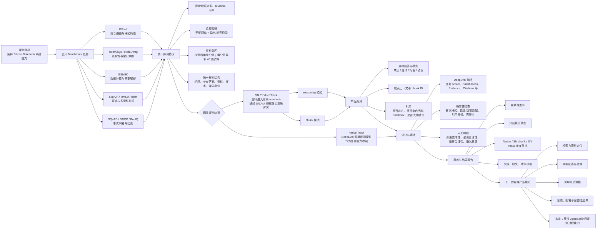

# Silicon Notebook 公开 Benchmark 评测项目

> 汇报背景：本页用于展示早期项目结构，实验成绩和当前代码状态以 [评测状态](evaluation-status.md) 为准。

交互式动态流程图：[打开 SQuAD → Silicon Notebook 动态评测流程](squad-flow-interactive.html)。

> 汇报用一页框图：目标是用公开、可复现的任务，解释 Silicon Notebook 在真实 notebook 场景中的系统能力。当前实验正在公司服务器上执行，图中“实验结果”部分等待回填。

想动态查看一条 SQuAD 样本如何流经 SN 评测系统，可打开[交互式 SQuAD 流程演示](squad-evaluation-flow.html)。页面支持逐步播放，并展开 SN Ask、检索、context、回答、引用和评分细节。

## 图中各层的含义

| 层次 | 要回答的问题 | 当前产物 |
|---|---|---|
| 公开任务 | 系统面对哪些可复现问题？ | 10 套公开 Benchmark 及固定选题规则 |
| 统一协议 | 如何保证不同任务的输入、输出和身份一致？ | `public-selection-v1`、统一 case、来源哈希 |
| 资料分区 | 一个 notebook 里放哪些资料？ | `public-corpus-partitions-v1`、分区 product bundle |
| 两条轨道 | 模型能力和系统能力如何区分？ | Native 参照、SN Product 端到端运行 |
| 产品观测 | SN 实际做了什么、返回了什么？ | Ask、回答、状态、检索上下文、引用、事件 |
| 评分审计 | 哪些可以机器判断，哪些需要人看？ | DeepEval 指标、确定性检查、人工校准 |
| 报告解释 | 结果能说明什么，不能说明什么？ | 覆盖率、分区状态、三轨对比、限制和异常 |

## 汇报时可以这样概括

这个项目不是只测一个模型的答题分数，而是把公开 Benchmark 转换成 Silicon Notebook 可以执行的系统任务：先固定数据和资料边界，再让 SN 在隔离 notebook 中通过 Ask 回答，随后同时保存回答、检索上下文和引用。DeepEval 用于通用语义和任务评分，确定性检查负责身份、格式、数值和完整性，人工判断负责引用支持性与澄清/拒答合理性。最终把 Native 模型参照、SN 的 chunk/reasoning 结果和执行覆盖情况分开报告，从而定位 Silicon Notebook 的具体产品能力。

## 当前状态

- 评测框架、公开 Benchmark 适配、选择容器、资料分区和运行/报告代码已写入并同步到远程分支。
- 公司服务器正在进行数据下载、SN 实际运行和评测实验。
- 结果尚未完成；人工校准后才能讨论质量阈值或发布门禁。
- 当前范围不包含交互可靠性、资料更新后知识一致性，以及尚未获得真实轨迹的 Agent 过程指标。