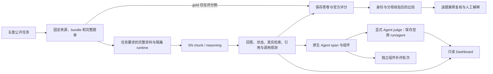

# Silicon Notebook 五套 Benchmark 评测项目

本页说明当前评测对象与结果阅读顺序。支持范围为 QASPER、MultiHop-RAG、ALCE（ASQA/QAMPARI/ELI5）、QMSum、HotpotQA；实现与实验事实见[当前状态](../CURRENT_STATE.md)和[评测状态](evaluation-status.md)。

```mermaid
flowchart LR
    A[五套公开任务] --> B[固定来源、bundle 和完整题单]
    B --> C[任务要求的完整资料与隔离 runtime]
    C --> D[SN chunk / reasoning]
    D --> E[回答、状态、真实检索、引用与调用观测]
    E --> F[保存答卷与官方评分]
    B -->|gold 仅在评分侧| F
    F --> G[身份与分母核验后的比较]
    G --> H[逐题案例复核与人工解释]
    E --> I[原生 Agent span 与组件]
    I --> J[显式 Agent judge：保存至原 run/agent]
    I --> L[独立组件补评批次]
    E --> K[只读 Dashboard]
    J --> K
```

Dashboard 读取保存的 run 及其中的 agent 工件；官方 submission／scores 和独立组件补评目录由各自报告读取，不能直接作为 Dashboard run 输入。

## 各层职责

| 层次 | 要回答的问题 | 产物与边界 |
| --- | --- | --- |
| 公开任务 | 系统面对哪些可复现问题？ | 五套固定任务、来源与评分标准 |
| 输入身份 | 实际用了哪些题目和资料？ | frozen bundle、完整 scope、无 gold 生成请求；不能按低分删题 |
| 执行隔离 | 一次运行的可变状态归谁？ | partition × mode × attempt 的独立进程和 run-dir |
| 产品观测 | SN 返回了什么、引用了什么？ | 保存回答、状态、实际上下文、引用、排名／span；没有观测不补造 |
| 评分与比较 | 分数是否可追溯、是否可比？ | 官方 scorer 身份、实际分母、逐题配对；模型与预算差异明确披露 |
| Agent | 过程指标是否有真实轨迹？ | 组件分与显式完整轨迹分分开，普通 reasoning 不自动产生 Agent 分 |
| 报告解释 | 哪些已完成，哪些仍缺失？ | 有效／错误／缺失／待评分、人审材料和比较限制 |

参考方法和公开答卷按来源类别分别标识。端到端分差不能直接归因于检索或某个模块；上下文覆盖和引用对象存在率不能代替官方证据分或引用语义支持。

代码离线验证与服务器正式模型运行分别记录，当前没有因此产生五套正式排名或发布门槛。操作见[RUNBOOK](../RUNBOOK.md)，协议见[标准与实现符合性](notebook-benchmark-standards-and-conformance.md)，展示见[实验 Dashboard](experiment-dashboard.md)。
