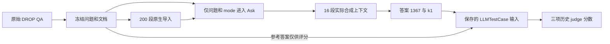

# 一题到底：从 DROP 原文到 Silicon Notebook 评分

本例完全来自已完成的 `20260909T122132Z-smoke-7f0fd2da`，未重新调用产品或 judge。可随 Git 查看完整[公开样例快照](examples/drop-smoke-case.json)：原始 QA、冻结文档和问题、导入映射、完整产品输出/合成捕获、三条历史评分。快照未附密钥、服务地址、DB 或私有语料；provenance 保留原工件哈希。它是历史摘录，不是新正式标注集。

## 1. 原始数据与参考答案

原文件：`data/public-benchmark-v1/raw/drop_dataset.zip` 中 `drop_dataset/drop_dataset_dev.json`，section 为 `history_1125`，query_id 为 `b13d08ae-53b0-47ce-ab02-954db5fd58b0`。冻结后的 case ID 加 `drop-` 前缀。

问题原文：

> What year was Edward III of England grandson, Richard II, born?

原文最后一句：

> Edward died in 1377, leaving the throne to his grandson, Richard II, then only ten years old.

完整 823 字符段落在样例的 `document.text`，不是只有这一句进入产品。原始主要答案为 date/year `1367`，validated_answers 同时含 number `1367` 和 date/year `1367`。适配后 `references=["1367"]`，`answer_type="mixed"`，`evidence=[]`；它没有官方操作数/推理步骤标注。

解释性复算为 `1377 - 10 = 1367`。这是从已保存原文读出的算术解释，不是已采集的产品内部推理步骤，也没有替代人工校准。精确生日未给出；本例按数据集允许的年份精度评分。

## 2. 原生导入与 Ask

冻结文档 ID 为 `drop-history_1125`，UTF-8 原文 SHA-256：

```text
ffe74d1b198440e9b8278d4e3c71620926bf039e054f158213c44977673da418
```

本 cell 有 200 段候选文档，原生导入形成 200 个 chunk，embedding 覆盖 200。产品源码版本为 `8ffd147e899f87529085b0ef7fe6f31d4a5904f6`（历史审计/identity，不用今日 HEAD 回填）。该文档映射为：

| 层级 | 实际 ID |
|---|---|
| public document | `drop-history_1125` |
| source | `src-7386bb7886794fa88a7ebd94d20c876f` |
| chunk | `ck-01546dd81fbc4a369c0d6497c8881588` |
| source element | `el-src-7386bb7886794fa88a7ebd94d20c876f-0001` |
| 本次正文锚点 | `k1` |

原生入口按保存源码构造如下（请求重建说明，不是抓取到的 HTTP wire payload）：

```python
repo.ask(notebook_id, AskRequest(
    question="What year was Edward III of England grandson, Richard II, born?",
    mode="chunk",
))
```

文档通过 `upload_sources` 导入；Ask 显式参数只有问题和模式，未传 gold 文档 ID、参考答案或答案 span，也未指定 conversation_id。共享固定候选库不等于给每题直接提供 gold 段落。适配代码见 [benchmark_runtime.py](../src/rag_eval/benchmark_runtime.py)。

## 3. 实际上下文与答案

本题 `captures[0].method="_answer_chunks"`，成功且非分节；保存 `context_block`、`id_map`、`ordered_handles` 和预算。`retrieval_context` 共 16 段，第一段为 `k1: ` 加完整目标段落，其余 15 段也实际交给合成器，完整保存在快照。

正文输出：

> Richard II was born in 1367 [k1].

`status=success`、`persistence_verified=true`，延迟 `2.2934690679976484` 秒。产品自身 `grounded=true` 是被测输出，不是独立裁判标签。历史审计证明上下文与保存的 synthesis interceptor 相符，**未声称逐字等于完整 provider 请求**。

实际链路：



## 4. 确定性检查能证明到哪一步

| 检查 | 保存事实 / 本次离线核对 | 能说明什么 |
|---|---|---|
| 原文哈希 | 与导入 map 的 SHA-256 相符 | 导入原文身份一致 |
| 文档命中和覆盖 | evidence_hit=1.0、evidence_coverage=1.0 | gold 文档进入最终上下文；不命名 Hit@16 或候选召回率 |
| 排名 | ranking_available=false | Contextual Precision/MRR/nDCG 无可靠输入 |
| 数值 | 正文年份 1367，与参考值和解释性算术相同 | 本题结果可复核；不代表通用数值解析器已实现 |
| SQuAD span | unknown / not_squad | 本题属于 DROP，不能编造 span 到达率 |
| 历史 citation 对象检查 | 16 个对象、16 个有效、0 个无效 | 当时对象存在且归属映射成立；本次不重开 DB |
| 正文引用 | 只有 `[k1]`，anchors 只有 k1 | 真正用到的锚点分母是 1，不是 16 |

锚点链为 `answer.[k1] → response.anchors.key=k1 → object_id=chunk → source_id/element_id → document-map → 冻结原文`，也与 capture 的 `id_map.k1` 相符。`response.citations[0].quoted_span` 仅为前部预览，未含最后一句年份依据；**应回查完整对象及合成文本**，不能拿截断预览判断引用造假，也不能把 16 个可解析对象当作 16 条正确引用。

引用语义需要人核验“这条 claim 是否被它实际引用的内容支持”；全答案 Faithfulness 可能受到其他上下文支持，不能代替逐引用核验。

## 5. DeepEval 输入与最终历史评分

历史 runner 使用 [expected_answer](../src/rag_eval/quality_metrics.py) 将参考答案序列化为 JSON 备选，再由 [to_test_case](../src/rag_eval/cases.py) 构造对象。下面只构造输入，不调用评分：

```python
import json
from pathlib import Path
from rag_eval.cases import to_test_case
from rag_eval.quality_metrics import expected_answer

example = json.loads(Path("docs/examples/drop-smoke-case.json").read_text())
record = example["output"]
case = to_test_case({**record, "expected_answer": expected_answer(record)})
assert case.input == record["question"]
assert case.actual_output == "Richard II was born in 1367 [k1]."
assert case.expected_output == '["1367"]'
assert case.retrieval_context == record["retrieval_context"]
```

| metric / judge_repeat=0 | status | score | 耗时秒 | 历史理由的中文摘要 |
|---|---|---|---|---|
| Answer Correctness（GEval） | valid | 1.0 | 0.8561304850009037 | 年份与参考一致，回答完整 |
| Faithfulness | valid | 1.0 | 27.952667368997936 | judge 判断答案与上下文没有矛盾 |
| Answer Relevancy | valid | 1.0 | 1.3694809680018807 | judge 判断答案直接回应问题，无无关内容 |

以上是已经保存的 judge 结果，原始英文 reason 与调用 usage 均在快照。Correctness 的 evaluation_params 只有问题、答案、参考答案，**其“正确”判断没有直接复核原文操作数**；证据一致性由另一个 metric 诊断。每项 `valid` 只表示判分成功，不表示人工认证。

本题 `diagnostic=false`，三项 Contextual 指标未计划执行，不能填 0、1 或 missing。若将来另开诊断评分，Precision 仍因无排名跳过。本题三项各向 drop/chunk/regression 的对应指标贡献一个 valid 分数；没有跨指标、跨数据集合成的产品总分。

## 6. 运行分母与人审边界

该 smoke 总体为 40 个计划输出，38 个成功、2 个产品错误；共 120 条主指标记录，114 条 valid、6 条因产品错误 skipped。完整性审计通过说明记录和计划对齐，不表示 40 题答对，更不表示 baseline 已完成。

本题产品日志事件 2 次，usage 齐备，prompt/completion/total tokens 为 7063/99/7162；三项 judge 共 8 次日志事件、14761 total tokens。费用均为 null。两种调用分别记账，不能把 judge token 当成产品成本；其他样本 usage 不齐时只能报部分和。

本题需要人审的事项仍是：年份精度是否满足问题、算术支持是否充分、正文引用是否支持 claim。展示样例不填入人工标签，也不据三项 1.0 设置阈值。后续按[实施计划](superpowers/plans/2026-09-10-product-capability-evaluation.md)补离线归一化和引用检查。
