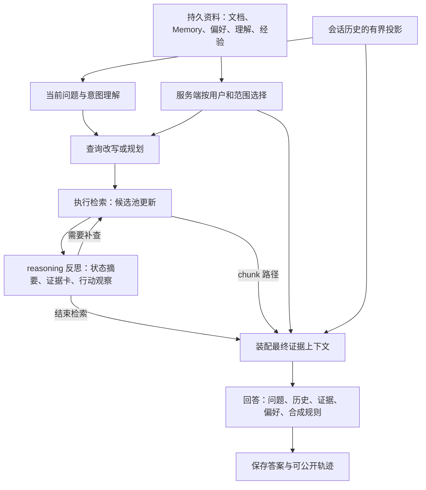

# Silicon Notebook 的 Memory 与 Agent 上下文

核对日期：2026-09-10，产品源码 `8ffd147e899f87529085b0ef7fe6f31d4a5904f6`。这是对产品文档及代码的静态核对，没有新运行产品。开关是否在某轮启用必须看该轮有效配置；“源码有此能力”不表示现有 benchmark 测到了它。[广度优先计划](product-capability-breadth-plan.md)据此安排扩展。

## 1. 这里的 Memory 指什么

此前建议评测的 Memory，主要指 **用户在 Silicon Notebook 中主动保存、确认的私有知识记录**。例如用户读完一次回答，确认“这个实验的温度条件是 25°C”，将它保存为可在之后相关问题中检索的笔记。示例只是说明数据形态，不是技术事实。

产品中还存在其他被称为 memory/profile 的机制，应分别理解、分别评测：

| 名称 | 保存什么、从哪里来 | 持续范围 | 用在哪儿 |
|---|---|---|---|
| 会话历史 | 当前 conversation 过去的问题与回答结论 | 跨本会话轮次；新会话不会自动带入 | 追问理解/查询改写、规划与答案合成的相关分支 |
| 用户知识 Memory | 用户确认保存的知识笔记；Agent 可提交待确认候选 | 持久化；归创建者私有，绑定一个 notebook | 与本题相关的 confirmed 记录可作为带身份的补充证据进入正式 Ask |
| 笔记本理解（agent profile） | 语料形态、关键实体、资料空缺；当前用户的检索心得/使用空缺 | 持久化；notebook 共享底座 + 当前用户私有覆盖层 | reasoning 的规划和反思；不作为可引用的答案证据 |
| 检索策略经验 | 过去运行提炼出的“这类问题适合哪种检索动作” | 持久化、部署级共享；设计为封闭情境与动作，不存个人问题原文 | reasoning 规划/反思的被动提示，以及条件性 consult_memory |
| 我的回答偏好 | 语言、回答形状、详略、术语偏好 | 持久化、按用户 | Ask 规划与答案合成；用于表达，不授权扩大来源范围或放松事实约束 |
| 本次 Agent 工作状态 | 子查询、候选证据、执行动作、预算、大纲、未回答方向等 | 当前一次 Ask run | reasoning 迭代，每步按需要渲染成新的模型输入 |

**Memory 的持久化和模型的上下文是两回事。** 记录可以一直在数据库里，但只有本次程序选择并放入请求的内容，才是本次模型调用可见的输入。不能因为“存了 Memory”就认定“模型一直看得见”。

## 2. 用户知识 Memory 的实际边界

依据 [产品/API 文档 Memory](../../project/docs/product-and-api_zh.md#memory-与-agent-mcp)、[memory_service.py](../../project/backend/app/services/memory_service.py)、[memory_retrieval.py](../../project/backend/app/services/memory_retrieval.py)：

1. 从 Ask 回答点击“保存到 Memory”会先预览，用户最终确认后才写入 confirmed。Agent 自己只能创建 candidate；未确认不进入正式 notebook Ask、搜索和 Deep Report。
2. 状态包括 candidate/confirmed/rejected/deprecated。rejected/deprecated 排除；candidate 可在有权限的 Agent 候选检索平面使用，但不能混入正式问答证据。
3. 正式 Ask 先按用户、notebook 和相关性检索 confirmed Memory，不把全部 Memory 塞入模型。当前 Ask 调用上限 8 条，Memory 文本块另有单条 1,200 字符、合计 6,000 字符预算；最终合成还受路径预算约束。
4. 当前 notebook 的来源范围确实被收窄时，Ask 的私有 Memory 召回被关闭。仅取消一个参考库与收窄本地来源不是同一条件；必须按实际 scope 规则判定。
5. 被使用的 Memory 有对象身份和 provenance；知识 Memory 可参与证据，而理解块/策略经验/表达偏好没有资格充当事实引用。
6. 产品文档规定相关性先于权威；同等相关或冲突时有 `candidate < personal 原始证据 < confirmed Memory < base 证据` 的规则。评测应显式标明来源角色，不能自行规定所有“文档”一律覆盖所有 Memory。

所以第一批 Memory 评测应回答“相关且已确认的笔记有没有被恰当使用，候选和无关笔记有没有被错误使用”，不扩成所有长期记忆算法的研究。

## 3. consult_memory 名字特别容易误解

在 [ReasoningRetriever](../../project/backend/app/services/reasoning_retrieval.py) 中，`consult_memory` 查的是 **检索策略经验**，也可以补充尚未展示的当前用户检索心得。它不是 `_memory_hits()` 那个检索用户 confirmed 知识笔记的入口。

它受开关、经验库接线和检索力度约束，当前允许 deep/thorough/exhaustive 档位；一次 consult 本身是内存中的选择/渲染，不额外做 LLM 或 embedding 调用，但选择它会占用反思动作预算。结果被有界地累积到之后反思输入中。评测“是否出现 consult_memory 步骤”不能作为“用户 Memory 功能有效”的证明。

本版广度计划先覆盖用户知识 Memory 和回答偏好；笔记本理解与策略经验的开关对照列为后续实验。自动归纳/蒸馏和资料变更后的刷新机制不在本轮范围。

## 4. 一次 Ask 中有哪些上下文

下面描述通常的 Ask 路径。已确认意图、目录导读、分节合成等分支可能跳过部分步骤；不能把图中每个节点当作每题必跑。

| 阶段 | 模型/程序处理的主要内容 | 随什么变化 | 不能默认拥有的内容 |
|---|---|---|---|
| 接收与意图处理 | 当前问题、有效来源/参考库范围、会话历史；可选的已确认意图 | 每个用户回合 | 未检索的全部文档；repository 直接调用与 HTTP 预览并不相同 |
| 查询改写/规划 | 问题、有效历史；reasoning 还可能有集合地图、笔记本理解、策略经验、偏好 | 问题与配置变化；已确认方向时可跳过 planner | 所有原文与全部 Memory；上一轮完整模型内部推理 |
| 检索执行 | 子查询、过滤范围、索引；结果合入服务器候选池 | 每个动作 | 检索不总是 LLM 调用；候选池内容不自动等于模型所见 |
| reasoning 反思 | 当前问题、候选摘要；有条件的 profile/经验/集合信息、剩余额度、大纲 | 每轮反思重新装配 | 历次完整 prompt 和所有候选原文 |
| reflect v2 分支 | 在上项基础上分开构造服务端状态、预算内证据卡、近期动作观察与必答方面 | 新证据、已绑定证据、遗漏、预算随轮次改变 | v2 受开关控制；不能声称历史 benchmark 都使用此分支 |
| 最终合成 | 合成规则、当前问题、有效历史、选定且预算内的真实证据、相关 Memory、偏好；部分分支有终止/限制说明 | 根据检索结果与合成预算确定；分节时每节不同 | 笔记本理解块/策略经验不直接当答案事实证据；完整控制器状态也不一定传入 |
| 保存之后 | 数据库保存答案；后续同 conversation 可以读取其结论，另有可选后台任务 | 新回合重新读取/组装 | 保存不等于模型自动获得永久记忆，也不会自动把每份答案确认为知识 Memory |

规则可能直接编入 user prompt，也可能由 system 消息提供。当前代码没有一个“所有阶段共享且永远包含全部信息的 system prompt”；每个调用点有自己的模板和输入。

## 5. 哪些一直有，哪些会变

“一直有”要区分三个层次：**持久存着、服务端本次持有、模型当前可见**。

| 内容 | 数据库/服务端寿命 | 模型可见性 |
|---|---|---|
| 用户身份、notebook、来源范围、配置 | 一次 run 内作为控制边界；新回合可不同 | 很多由代码强制执行，不需要完整写入 prompt；不是模型自行记住权限 |
| 当前问题和已确认要求 | 一次 run 的任务依据相对稳定 | 依阶段以问题、改写问题或约束清单传入，表示形式可不同 |
| 各阶段规则/输出 schema | 同一代码与配置版本下相对稳定 | 每次调用构造相应规则；不同阶段规则不同 |
| 文档、confirmed Memory、偏好/理解/经验 | 跨会话持久化，可供读取 | 按范围、相关性、开关和预算选择，不保证每次都展示 |
| 会话历史 | 会话记录持久化 | 当前 SQLite/PostgreSQL history 默认取最近 5 个已存回答回合，内容是 User 问题 + Assistant conclusion，不是完整答案和全部引用；新会话为空 |
| 候选池、执行账本、大纲 | 本次 run 的程序状态 | 每轮渲染摘要/证据卡，内容会新增、替换、裁剪；程序持有不代表模型已看到 |
| 最终上下文 | 当前合成调用的输入快照 | 单次确定；与反思所见不同，分节之间也不同 |

会话还有一个已实现的边界：`scoped_conversation_history()` 在本地来源或参考库范围确实收窄时返回空历史，避免旧答案把范围外的内容重新带入。多轮评测不能在这种场景下无条件要求模型继续理解未重新指明的对象。文档介绍路径还可只用过去用户请求保持表达要求，不携带旧助手答案。

这些是服务端如何显式组织上下文的事实。provider 是否还附加了内容、精确 token 数、每个分支实际发送了什么，需要运行时观测，不能由源码说明代替。

## 6. 对新评测的直接影响

- **多轮套件**：同一会话按顺序 Ask，观察实际传入历史；跨会话不接续。先测 3 轮，历史窗口边界另作少量诊断，不要求无限记忆。
- **知识 Memory 套件**：同一问题比较无 Memory / confirmed / candidate 等预置状态，问题本身不能包含 Memory 中的答案。每个条件独立 runtime，避免上一题答案造成污染。
- **偏好套件**：对照相同事实答案在 prose/table_first 或中文/英文条件下的表达；事实和引用仍须有效，不以“满足格式”抵消错误。
- **理解/策略经验套件**：单独冻结这些块，先观察是否送达和作用阶段，后续才研究质量/开销差异；不通过后台蒸馏临时制造实验输入。
- **观测最小补充**：现有 `capture_synthesis()` 主要保存 evidence context，不保存完整 history/style/最终 prompt。未来在 benchmark 进程的已有方法边界做只读观测，明确 input_role（task/history/evidence/style/strategy）及 stage；不修改生产源码、不把 history 当 retrieval_context，也不编造完整 trajectory。

当前公开 benchmark 使用新 notebook、独立问题，并关闭 profile、策略经验注入、consult 等机制；不能用那 400 次 Ask 推断 Memory/偏好的质量。补齐这里需要的是少量专用状态场景，不是扩大 SQuAD/DROP 题数。

## 7. 核对入口

- [产品 Memory 与 Agent MCP](../../project/docs/product-and-api_zh.md#memory-与-agent-mcp)、[AI 对这个库的理解](../../project/docs/product-and-api_zh.md#ai-对这个库的理解)、[检索策略经验](../../project/docs/product-and-api_zh.md#检索策略经验)、[我的回答偏好](../../project/docs/product-and-api_zh.md#我的回答偏好用户检索回答风格-profile)。
- [AskService](../../project/backend/app/services/ask_service.py)：`_memory_hits`、`_answer_chunks`、`_answer_reasoning`、`_prepare_reasoning_stage`、`_search_profile_style_block`。
- [ReasoningRetriever](../../project/backend/app/services/reasoning_retrieval.py)：`consult_memory_active`、`plan`、`_reflect_v2_context` 及反思循环。
- [reasoning_context.py](../../project/backend/app/services/reasoning_context.py)：证据卡选择/裁剪、可见证据与候选池区分。
- [SQLite 历史投影](../../project/backend/app/repositories/sqlite/ask_state_store.py)、[PostgreSQL 历史投影](../../project/backend/app/repositories/postgres/ask_state_store.py)：`_conversation_histories`。
- [source_scope.py](../../project/backend/app/services/source_scope.py)：`scoped_conversation_history`；[prompts.py](../../project/backend/app/services/prompts.py)：`answer_prompt`。
- [benchmark 观测](../src/rag_eval/system_capture.py)与[隔离配置](../src/rag_eval/benchmark_runtime.py)。产品源码链接需要同级 project checkout。
