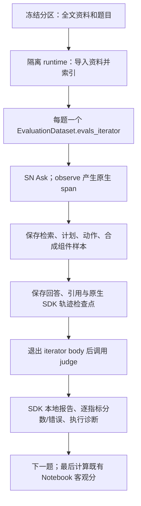

# SN 原生 DeepEval 评测

文档状态：当前协议。Agent 新运行使用 `sn-deepeval-native-v1`；评分超时后的动作见 [原生评分恢复](native-scoring-recovery.md)。


服务器验收遇到评分超时后，当前操作顺序见[评分恢复说明](native-scoring-recovery.md)：先对已保存组件逐项补评，再单独处理整轨迹。新增 `--metric` 和 `score_native_components.py`；每个完成的指标立即保存。这覆盖下文“最大题一次运行全部指标后扩大”的初始安排。SN 补丁不变。

2026-09-22 起，新 Agent 实验使用 `sn-deepeval-native-v1`。SN 真实调用直接产生 DeepEval span，运行器在同一隔离进程挂接组件和可选完整轨迹指标。旧 `sn-execution-trace-v1` 仅作历史档案；不重建旧树、不写 SDK 私有 `_trace_dict`。

## 调用和职责

入口 `scripts/run_notebook_agent.py` 复用冻结分区、原生导入、索引和 Ask，逐题串行。每次命令创建独立 notebook/database/storage/cache/config/runtime；chunk 与 reasoning 分开运行。它调用 SN Python 业务方法，不向正在运行的 SN HTTP 服务发送请求。生成模型由 SN TOML 决定，judge 由独立 JSON 决定。



SN `app.core.evaluation_tracing` 是可选薄封装：公开 `observe`/`update_current_span` 管理原生观测，具名选择器投影业务字段，回调交给评测侧。SDK 拥有 ID、父子关系和生命周期；SN 不维护第二棵树，不包含 gold、judge 或质量门槛。关闭时不导入 DeepEval，原业务执行一次。开启时同进程需要 **DeepEval 4.2.2**，见 `backend/requirements-evaluation.txt`。

`rag_eval.native_agent.NativeAgentEvaluation` 负责 golden、test case、指标、judge、落盘和诊断。每题一个同步 iterator，使用公开 `update_current_trace`/`update_current_span` 关联指标。本地检查点选择 SDK 对象中的数据字段，不序列化 metric/client/数据库或整个运行环境。

## 输入、指标与适用范围

| 对象 | 实际输入输出 | 指标 | 解释及 N/A |
| --- | --- | --- | --- |
| 单次文本检索 | query、当次返回证据 | ContextualRelevancy | 无 query、空结果或组件失败保留原因；相关性不等于 gold 召回率 |
| 多查询检索 | 每个 query 对应的实际候选，关联共同父 span | 每 query 一个 ContextualRelevancy | 不将合并结果冒充每个 query 的结果；映射缺失 N/A |
| 最终/分节合成 | 实际 question、真正送入该次合成的 context_block、该次答案 | Faithfulness、AnswerRelevancy | 无答案 N/A；缺上下文时 Faithfulness N/A；每节独立，不拼成不存在的全文调用 |
| 完整请求 | 原生执行树、请求和回答 | TaskCompletion、StepEfficiency | 默认关闭，显式 `--trajectory`；无答案、澄清、错误或观测不完整不产生有效整轨迹分 |
| 有显式计划的 reasoning | 计划、修改、反思、实际动作 | PlanQuality、PlanAdherence | 需 `--trajectory` 和可观察计划；chunk 没计划不扣分 |
| 执行诊断 | 具名调用次数、证据重复、耗时和 usage | 确定性统计 | 包装与业务动作分开计数；重复证据不是无效操作的判决 |

检索/合成在真实 span 存活期间挂接 `LLMTestCase`。多查询共用一次底层调用时，一个真实 span 不能容纳多份不同 query 的同一 test case；因此逐查询样本使用公开 `evaluate()` 评分，以 `request_id/span_id/sample_id/query_index` 关联。SDK 为它们导出独立报告组，不伪造子调用或执行时间。

合成证据来自真正使用的上下文，不用初始候选全集、gold 或事后补找证据替代。计划/反思/动作保留真实输入输出。LLM span 表示应用层逻辑调用，不能直接当成 provider HTTP 尝试次数。

这里覆盖已列出的原生调用边界，不声称每条内部检索路径都已有独立 span。Notebook runtime 明确关闭 KG overlay；混合/keyword/exact 检索子路径不是本轮组件完整覆盖或 KG 专项评测范围。

## 工件与失败语义

| 位置，相对 run-dir | 内容 |
| --- | --- |
| `outputs.jsonl`、`scores.jsonl` | 既有 SN 回答、引用、产品观测和 Notebook 客观分；普通重评分继续可用 |
| `judge-events.jsonl` | 独立 judge 请求身份、usage、状态 |
| `agent/native-manifest.json` | 协议、SDK、judge、完整轨迹开关 |
| `agent/components.jsonl` | `record_type=span`：具名原始投影；`sample`：实际组件评分输入及关联 ID |
| `agent/native-outputs.jsonl` | 产品记录与原生评测 request ID |
| `agent/native-traces.jsonl` | 评分前和结束时的原生 SDK 检查点，保留 ID/树 |
| `agent/native-scores.jsonl` | 分数、judge 理由、范围、N/A 原因或 error；不补零 |
| `agent/native-diagnostics.jsonl`、`native-summary.json` | 逐题诊断、product_seconds/judge_seconds、总体状态 |
| `agent/native-errors.jsonl` | 发生异常时记录阶段和异常类型 |
| `agent/sdk/<request_id>/` | SDK 本地评分报告，多查询各有独立报告组 |

回答和组件样本先落盘，之后 SDK 开始评分。judge 失败不改产品回答状态；run 可以 `finished_with_errors`，缺分保留 error。观测错误不重跑业务，也不把缺失树评分当成完整 Agent 分。取消保留已写工件并终止。

没有适用指标时，SDK 4.2.2 可能抛出 `NoMetricsError`；保存原生检查点及明确 N/A，不添加假指标凑报告。默认只本地保存，不上传 Confident AI；原始文本留在实验目录，分享时提取必要的脱敏结果。

产品耗时包含观测/落盘开销，judge 耗时另计；产品 usage 沿用 SN 记录，judge usage 来自显式模型适配器。SDK 默认 threshold/pass 字段不是发布门禁，不跨指标计算总分。

## 运行示例与验收顺序

先按[补丁包说明](../integrations/silicon-notebook/README.md)更新独立 SN worktree。使用同时具备 SN 依赖和固定 SDK 的 Python。`--judge-config` 沿用 [JSON 示例](../configs/public-starter-models.example.json)的 `judge` 段，仅需 judge 角色；环境变量保存凭据，模型参数由服务器填写。

```bash
python scripts/run_notebook_agent.py \
  --project-root /path/to/sn-native-evaluation \
  --model-config /path/to/model-services-run.toml \
  --judge-config /path/to/agent-judge.json \
  --bundle /path/to/frozen-qmsum-bundle \
  --partition-id ACTUAL_MEETING18_PARTITION_ID \
  --mode reasoning --request-revision notebook-request-v2 \
  --case-id qmsum:18:specific:3 --trajectory \
  --run-dir /path/to/NEW-native-reasoning-largest
```

chunk 使用同一题、同一分区和另一个新 run-dir。`--case-id` 只限制提问，不删分区资料，因此该题仍面对整场会议。可重复该参数选择多题，按冻结顺序执行；未知、重复或空选择在建立实验前拒绝。新 Agent 入口默认 request-v2，普通 Notebook 命令默认不变。

首次服务器验收同时运行组件和整轨迹指标。最大题两模式链路可用后，去掉 `--case-id` 完成 meeting18 六题 × 两模式。若避免重复最大题，可显式选择剩余五题，用两个批次共同覆盖六题；不可回填旧批次题单。不自动扩大到 35 场会议。

原生接入不会自动解决超窗。完整指标继续使用原始树和能承载它的 judge；超窗/超时保留失败，不自动裁剪、摘要、换模型或反复提交。组件分减少每次评分范围，不是完整 Agent 分的替代。

## 删除与保留

保留 QMSum request-v2、BM25 的旧回答及客观分，普通 Notebook 重评分仍可用。旧 Agent 分和超窗记录只作历史，不混入新协议批次；不会因升级而重跑全部问答。

旧的 Agent 输入检查脚本、手工 SDK 树注入和离线判分开关均已退役；`evaluate_agent_traces.py` 仅保留历史 JSON 的确定性诊断。普通 Notebook 的旧轨迹采集开关由新 Agent 命令替代。不新增旧树迁移层、Dashboard、DAG、新 benchmark 或发布门槛。

## 依据和验证

官方[组件评测](https://deepeval.com/docs/evaluation-component-level-llm-evals)推荐在真实 span 上挂接 test case/metrics，通过 iterator 驱动；[轨迹评测](https://deepeval.com/docs/evaluation-trajectory-based-llm-evals)使用请求级 Agent 指标。逐题本地导出、落盘次序与业务字段选择属于本项目工程安排，不是 SDK 自动保证。

网页可能比固定 SDK 新，实现以 4.2.2 公开接口和离线契约验证为准。本机证据见[验证记录](sn-execution-tracing-validation.md)，执行见[服务器 prompt](server-agent-tracing-prompt.md)。
