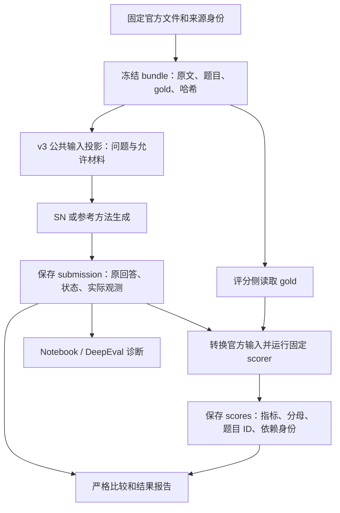

# 四套 Benchmark 的标准、实现对应与验收边界

核实日期：2026-09-25。适用于 `feat/benchmark-protocol-correctness` 工作树中的实现；实现提交为 `128246c`，已推送到 `origin/feat/benchmark-protocol-correctness`，尚未合并到本地 `main` 或部署到服务器。本文中的“当前实现”不等于主线或服务器已经部署的版本。

本页回答三个问题：**标准具体规定什么、框架在哪一层落实这些规定、现有证据能支持多强的结论。** 官方资源全集见[官方资料手册](notebook-benchmark-official-resources.md)，运行命令见[实验计划](notebook-benchmark-experiment-plan.md)，MultiHop/ALCE 的完整本地验收见[真实数据记录](notebook-benchmark-real-data-validation.md)。

当前结论是：四套固定版本的数据适配与生成输入隔离已做完整文件验证；QASPER 答案与 SN 最终引用证据评分、MultiHop QA/检索评分、ALCE 文本评分和 QMSum Perl ROUGE 已有对应校准。**这还不是四套 benchmark 全部指标、SN 全量运行和论文方法比较均已完成。** QASPER 新证据映射的适用范围、ALCE 真实模型评分与 MultiHop 排名观测等边界见下文。

## 1. “标准”不是一个指标名称

这里的标准，是一套有版本的评测协议。它规定“给系统什么任务和资料、收集什么输出、怎样打分、分数对应哪些题和条件”。这些研究 benchmark 没有一个共同的认证规范；协议需要从作者论文、发布数据、评分代码和作者澄清中还原。

| 协议层 | 必须回答的问题 | 忽略后的典型错误 |
| --- | --- | --- |
| 任务与轨道 | 是全文问答、检索、带引用生成，还是给定 gold 片段的摘要？ | 把拿到正确片段的模型与需要自己检索的系统直接比较 |
| 数据身份 | 哪个发布版本、split、原始文件、SHA256？一行是一篇论文还是一道题？ | 误把 QASPER 的 416 篇当 416 题，或混用 QMSum 279/281 题 |
| 题目范围 | 哪些 ID、什么顺序、为何排除、全量还是子集？ | 只留下成功题或可映射证据题，分母变小 |
| 可用输入 | 模型允许看什么？是否含摘要、元数据、候选顺序、gold span？ | 把答案类型、正确证据或 oracle 排序传入生成过程 |
| 方法条件 | 如何分块、检索、重排、截断、调用模型？预算和重试规则是什么？ | 同名模型却不同输入、token 预算或答案择优次数 |
| 输出契约 | 自由文本、实体列表、段落证据、引用编号、排名分别怎么提交？ | 从最终上下文反推“模型预测证据”或“检索排名” |
| 评分实现 | 哪份代码、参数、归一化、分词/分句和辅助模型？ | 用另一个 ROUGE 包或小型 NLI 替代官方实现，却沿用官方标签 |
| 汇总和失败 | 宏平均还是批量统计？空答、缺失、异常、条件分母如何处理？ | 将错误当零分、跳过难题，或重算平均改变官方总分 |
| 比较与报告 | 是否同题同规则？哪些差异需披露？能否归因于某个组件？ | 把本地 BM25 控制组叫作论文基线复现，或把小样本叫榜单成绩 |

必须区分四种主张：

1. **任务与输入遵循声明的轨道**：系统确实面对相同问题和允许的公开材料，没有利用评分标签。
2. **评分与固定官方实现一致**：相同答卷、参考答案、参数和依赖经过原实现与桥接层得到一致结果。只验证文本指标时，不能把结论扩到语义模型指标。
3. **复现原论文实验**：还要对齐论文所用数据、模型/检查点、训练、输入、提示、选择策略、推理预算及当时评分环境。
4. **构成公平比较**：需要说明比较的是整体系统，还是在其余条件受控时比较某项算法。两种实验都可有价值，但能支持的结论不同。

当前新评分工件明确写入 `official_paper_reproduction=False`。这表示使用固定官方评分规则的评测，并不自动意味着复现论文表格。

### 1.1 依据与冲突处理

论文用于确定任务意图和实验条件；固定发布文件决定本次实际题目；固定评分源代码决定精确执行细节；作者 issue 补充未写清的设置。本文对自己的适配和比较规则另行标注，不把它们写成作者要求。

来源之间有差异时，两边都记录。例如 QMSum 论文 test 为 279 对，而本次固定文件有 281 题；MultiHop 源代码中的 MAP 并非教科书定义。我们分别保留真实题数和原脚本口径，不删题凑历史数字，不静默“修正”官方公式。若将来另设严格指标或另一数据版本，应建立新的 profile 和独立报告。

## 2. 框架如何落实共同协议



gold 是标准答案和人工证据标注。冻结数据包内必须保留它们以便重评分；隔离发生在**送给被测系统和生成模型的接口边界**，并不是声称本机文件系统没有 gold。评分时才将标签与回答关联。涉及 gold 的事后诊断失败时，保留已生成的答案和单独的诊断错误。

### 2.1 逐层契约与代码位置

| 层 | 当前实现保证 | 代码入口与检查 |
| --- | --- | --- |
| 数据适配 | `notebook-data-v3` 保留公开原文边界、原始标注和题目；不按 gold 是否易映射删题 | [notebook_data.py](../src/rag_eval/notebook_data.py)：`adapt`、四个套件适配函数；[数据测试](../tests/test_notebook_data_v3.py) |
| 数据冻结 | 保存 `raw-data`、必要的 `raw-corpus`、`source.json`、cases/documents/decisions/partitions 及哈希；加载时从 raw 重建并比对，不能只改外层 hash 蒙混过关 | [notebook_bundle.py](../src/rag_eval/notebook_bundle.py)：`prepare`、`load_bundle` |
| 材料完整性 | 一个问题所需的完整材料范围不可因容量不足被静默拆开或截断；容量不足报错 | 同文件 `_build`；本次 MultiHop 显式容量 609，ALCE 100 |
| 生成输入 | `notebook-request-v3` 不发送 `references`、`expected_answer`、`gold_document_ids`；QASPER/MultiHop 不发送答案类型或 null 标签，公共 task 为 `qa` | 同文件 `request_question`、`partition_bundle`；[运行边界测试](../tests/test_notebook_v3_runtime.py) |
| SN 执行 | 公共材料进入独立 runtime；先保存生成观测，再关联评分信息 | [notebook_runner.py](../src/rag_eval/notebook_runner.py)、[system_runtime.py](../src/rag_eval/system_runtime.py) |
| 参考方法 | BM25、full-context、ALCE candidate-topk 只读公共投影；保存实际排名、入选上下文和预算排除 | [benchmark_reference.py](../src/rag_eval/benchmark_reference.py)：`plan_reference`、`run_reference`；[参考方法测试](../tests/test_benchmark_reference.py) |
| 答卷 | 固定题目范围与顺序、方法身份、原始回答和状态；缺题显式 `missing`，重复题/重复尝试不静默择优 | [benchmark_submission.py](../src/rag_eval/benchmark_submission.py)：`build_submission`、`validate_submission`、`export_sn_runs` |
| 官方输入与评分 | 由 bundle 与 submission 重建；固定源代码 SHA256，记录桥接代码/依赖身份；指标与实际参与题目绑定 | [benchmark_official.py](../src/rag_eval/benchmark_official.py)：`prepare_inputs`、`score_prepared`；各专用 scorer 见后文 |
| 比较 | 重建身份、检查同题同序同 scorer，以及每项共同指标的分母和参与 ID | [benchmark_comparison.py](../src/rag_eval/benchmark_comparison.py)：`compare_submissions`；[比较测试](../tests/test_benchmark_comparison.py) |

“完整材料可访问”与“一次 prompt 放入全部材料”不同。SN 可以在完整材料上检索；参考 BM25 可以按声明的预算选片段，但必须记录选择。`full-context` 的全部材料超出预算时拒绝推理，不截短后仍称全文输入。预算单位、选段策略属于方法配置，不能只写一个含义不明的 `top_k`。

**默认值边界：** `prepare_notebook_benchmarks.py` CLI 默认 data-v3，SN/Agent CLI 默认 request-v3；Python 的 `prepare()` 等数据 API 仍保留旧 data-v2 默认，`request_question()` 等仍保留 request-v1 默认以支持历史工件。新 API 调用者要显式传入 v3。官方输入准备拒绝旧数据版本，SN 官方答卷导出拒绝旧请求版本；不能把旧 run 改标签后复用为新轨道成绩。

### 2.2 不同错误不能混成一个分数

| 状态/情形 | 保存与解释 |
| --- | --- |
| `success` | 必须有非空回答；随后按该套件官方规则评分 |
| `no_answer` / `clarification` | 是已观察到的系统行为；答卷的可评分文本为空，原观测另存；仍进入声明范围，按对应 scorer 的空答规则处理 |
| `error` / `missing` | 保留失败或缺失事实；可生成用于排查的评分工件，但当前主比较入口拒绝不完整生成 |
| 某项指标 `pending` | 尚无所需观测/环境/执行证据；不补成零分，不宣称完整评分 |
| 指标 `not_applicable` | 如 MultiHop 的 null 问题不进入官方检索分母；不等于漏跑 |

空答不一定在每项指标上都是零。例如 QASPER 证据列表与 gold 都为空时 Evidence F1 为 1；ALCE 的 ASQA/ELI5 空句输出可能不进入 AutoAIS 聚合。QASPER 正确输出字面答案 `Unanswerable` 是成功提交的一种内容，与运行状态 `no_answer` 不同。

Notebook 原诊断、DeepEval Faithfulness/AnswerRelevancy、组件分和 Agent 轨迹分用于解释表现，不替代四套 benchmark 的官方指标。旧 [notebook_scoring.py](../src/rag_eval/notebook_scoring.py) 与 ALCE 诊断桥接轨道仍存在，应与本页的官方 submission/scorer 轨道分别标注。

## 3. QASPER：科研论文问答与证据

### 3.1 采用哪套标准

依据：[原论文](https://aclanthology.org/2021.naacl-main.365/)、[作者 HF 数据页](https://huggingface.co/datasets/allenai/qasper)、[固定官方 evaluator](https://github.com/allenai/qasper-led-baseline/blob/afd0fb96bf78ce8cd8157639c6f6a6995e4f9089/scripts/evaluator.py)。本次使用 v0.3 原始 test，而非 SCROLLS/LongBench 重包装版本。

| 项目 | 官方规则/本次声明的条件 | 框架对应 |
| --- | --- | --- |
| 任务单位 | 给定一篇论文和一个问题，回答并可预测支持段落 | 一篇论文一个材料分区，原始 question ID 对齐答卷 |
| 题目范围 | 当前 v0.3 test 的全部 416 篇、1451 题 | 0 排除；FLOAT 图表证据或 unmapped 标注不造成删题 |
| 公开输入 | 论文公开文本；具体 reader 的输入组成需另外对齐 | 当前提供标题、摘要、正文的节标题/段落及公开图表 caption |
| gold | 同题可有多个标注者；抽取、自由文本、Yes/No、不可回答均保留 | 标签仅评分侧可用，不把答案类型传入生成请求 |
| 答案格式 | 官方 evaluator 接收答案字符串 | v3 提示短答案；不可回答时输出 `Unanswerable`；SN 仅去掉 `[kN]` 引用标记后评分，原回答仍保存 |
| 证据格式 | 明确预测的原段落字符串列表 | 只使用 `predicted_evidence`；不把检索上下文自动当作预测证据 |

**已声明输入变体：** 当前输入额外提供摘要和 caption，与发布的 LED `full_text` reader 不完全相同。它们是公开信息，但增加可见信息会影响成绩。因此当前 profile 可评价“在此公开输入条件下的 SN”，不能直接声称与原 LED 表格条件相同。要比较 LED，需对齐 reader 或将差异单列。提供 caption 也不代表已做图像、表格结构或 PDF/OCR 评测。

### 3.2 精确评分规则

profile：`qasper-v03-full-text-answer-v1`；当前采用官方 `text_evidence_only=True`。

**Answer F1：** 官方函数将答案转小写、删除 ASCII 标点、去掉英文冠词 a/an/the、归一化空白，然后按 token 的多重集合计算重合数量。单个参考答案上的 precision = 重合 token 数 / 预测 token 数，recall = 重合 token 数 / 参考 token 数，F1 为二者调和平均；无重合返回 0，连双方都归一化为空时也返回 0。每题取多份参考答案中的最大 F1，再对范围内所有题宏平均。抽取的多个 span 用逗号和空格连接；Yes/No 与 Unanswerable 使用官方字面答案。

**Evidence F1：** 对预测与参考的原段落字符串进行精确集合交集计数，但 precision/recall 分母是原列表长度；重复预测不会凭空增加命中数。双方列表均空得 1，无交集得 0。每题独立取所有标注者中最佳 evidence F1，再对题平均；不要求最佳答案标注者与最佳证据标注者是同一人。

`text_evidence_only` 只过滤 gold evidence 中含 `FLOAT SELECTED` 的字符串，**不删除整道问题**。不可回答标注的 gold evidence 按官方 parser 转为空。官方 evaluator 对缺失 prediction 计零；我们同时保留缺失状态，并由主比较入口拒绝不完整答卷。

上游还返回按答案类型分组的 F1 和缺失数；当前正式 score 的主字段是 `answer_f1`，具备完整显式证据预测时再输出 `evidence_f1`。不能把所有上游附加字段都说成已进入当前报告。

参考方法要求模型返回答案和 `evidence_unit_ids`，只允许引用实际显示的单位。未知/重复 ID 保留错误预测槽位，使用不与任何公开段落冲突的占位字符串，防止“自动丢掉错误证据”抬高 precision。这是将模型输出转换为官方段落列表的本地契约，见 `benchmark_reference.py` 的 `_predict`。

### 3.3 已验证与尚未满足

- 完整 1451 题、416 篇的加载、公共原文单位、gold 变形后输入不变已验证；331 题包含 unmapped evidence，均保留。
- 原始官方 parser 与保存的参考答案/证据口径已对照；短答、不可回答、FLOAT、不支持证据预测、错误记录等边界有专门测试。证据见附录和 [QASPER 评分测试](../tests/test_benchmark_official.py)。
- QASPER 已完成各一题 SN/BM25 真实生成、官方评分和比较链路；只证明这条路径可工作，不代表 1451 题 SN 全量成绩。
- **已实现 SN 最终引用→原始段落预测→官方 Evidence F1。** 新运行保存证据快照，旧运行需显式只读恢复；一题真实保存答案已与原版 CLI 核对，完整公开语料已做无模型解析/截短验收。映射失败的批次仍为 pending，不生成部分题的 Evidence F1。详细政策及限度见 §3.5；“最终上下文包含 gold 段落”仍只能作覆盖诊断。
- 原 LED 论文实验、其训练/推理设置和输入组成尚未按同条件复现。

### 3.4 2026-09-24 引用追溯核查：谁负责补齐

**先行核查结论：由评测框架补齐接入；已核实的 chunk 路径不需要 SN 新增“能定位证据”的回答能力。** 本节保留实施前对产品 `74e9c61e4600102e5324553b55a85be15339660f` 及此前真实 QASPER run 的只读观察；该次审计没有新调用模型或改变评分。后续完成的接入见 §3.5。

实际样本为论文 `1911.10742`，问题 ID `397a1e851aab41c455c2b284f5e4947500d797f0`。SN 回答 `The ANTISCAM dataset contains 220 human-human dialogs [k1].`，保存的唯一最终 anchor 指向一个具体 chunk；该 chunk 含章节标题元素和正文元素。正文元素与公开原文的 `full_text[4].paragraphs[0]`（公共单位 ID `4:0`）完全一致，而且整个引用 chunk 确实出现在已保存的模型上下文中。追溯过程不读取人工答案或证据标注。

观察到的链路为：

```text
答案中的 [k1]
  → response.anchors 中的 object_id（具体 chunk）
  → 本次 runtime 数据库 chunks.element_ids（完整元素列表）
  → source_elements.metadata 中原文 char_start / char_end
  → 与冻结公开原文对齐的 QASPER 段落 ID / 原字符串
```

SN 的 `AnswerAnchor` 保存 object/source/element 标识，`EvidenceContextService.chunk_context` 建立引用编号到 chunk 的关系，`parse_anchors` 只返回答案实际使用的有效编号。相关产品源码路径为 `backend/app/models/ask.py`、`backend/app/services/evidence_context.py`、`backend/app/services/chunking.py`。实施前评测侧只有 `_anchor_documents` 的文档归属观测；现已在 [notebook_runner.py](../src/rag_eval/notebook_runner.py) 增加独立的原段落快照和预测，供 [benchmark_official.py](../src/rag_eval/benchmark_official.py) 回放校验。

几个已经观察到的边界决定了不能只补一行字段转换：

- 此例 `anchor.element_id` 是 chunk 的**起始元素——章节标题**，不是包含 220 条对话的正文。它用于产品跳转定位，不能直接等同于模型独立选中的 QASPER 证据段落；应先按 object_id 解析完整 chunk。
- 最终答案只有 1 个 anchor，但响应里还有 16 条候选/回退 `citations`。不能把这 16 条全部当作最终证据选择。
- `snippet` 是截短预览；本例真正包含数字的句子不在最前面的预览范围内。应使用保存的原文与实际显示上下文，不拿预览直接评分。
- 该论文 85 个解析元素、39 个 chunk 的来源位置可覆盖全部 54 个原始正文段落；其中 12 个 chunk 的原文范围覆盖多个正文段落。引用一个多段落 chunk，不证明模型独立选择了其中哪一段。后续需固定并披露 chunk→段落投影政策，不能参考 gold 挑最有利的段落。
- Markdown 解析可能改变显示文本，位置区间还可能包含末尾换行；严格文本相等不足以覆盖所有元素。应核对导入文本身份和原文区间，不靠模糊文本匹配猜段落。
- 产品 `chunk_context` 可能按预算截短最后一个块。评测映射须核对本次实际可见范围，不能把未显示的块尾部当作模型选中的证据。上述真实样本已验证完整可见，不代表其他样本也如此。

该次核查提出的接入与边界处理已按下节实施。若服务器真实 reasoning/KG 等路径仍缺少来源信息，应针对观测边界修复；单题审计和无模型语料验收都不能替代所有模式、全部 1451 题的真实生成验收。

可复跑审计脚本：`python3 var/benchmark-protocol-validation/qasper-anchor-audit-20260924/audit.py`（工作树根目录执行）。脚本以 SQLite `mode=ro` 打开已有 runtime，只用论文公开字段重建文本/段落区间，检查冻结文本与实际导入文本一致；产物和源码 hash 保存在同目录 `report.json`。这是一份来源追溯报告，不是已经接通 Evidence F1 的成绩。

### 3.5 2026-09-24 已实现的最终引用投影与特殊情况

方法政策为 `sn-qasper-final-citations-visible-units-v1`，实现位于 [qasper_evidence.py](../src/rag_eval/qasper_evidence.py)。**官方标准规定输入证据列表及评分公式；以下 chunk→段落投影是本项目公开声明的方法适配，不是 QASPER 作者强制规定的 chunk 策略。** 没有另加模型选择“最优证据”，也没有用 gold 反向选择、纠正或删掉预测。

流程和职责：

1. `notebook_bundle.py` 仅从公开 title/abstract/full_text/caption 重建位置目录。逐字核对冻结文档，保留原始段落字符串及 ID。该目录为派生内存数据，不改变 v3 bundle 文件/manifest，也不加入模型请求。
2. `notebook_runner.py` 在生成结束、关联 gold 诊断之前，读取最终答案 marker、`response.anchors`、对应成功合成的 `id_map/context_block`。只查询实际被引用的 chunk/element，核对源文档 SHA256、真实导入文件和来源归属，保存有界快照到 `outputs.jsonl` 的 `product_record.qasper_evidence`。
3. 快照含原文位置、引用对象文本、可见范围审计、单位 ID、预测列表及内容 hash。完整映射另保存 `predicted_evidence`；映射错误只保存错误状态/无内容错误码，不抹掉回答。新 run 的 identity 和 submission 的 method configuration 均声明政策与实现 SHA256。
4. 读取新 run、准备官方输入和评分时，从冻结公共目录、回答观测及快照重算预测，拒绝答案/预测/快照不一致。正式评分不依赖 live SQLite 或源文件。hash 是一致性与可追溯检查，**不是对恶意重写全部工件的数字签名或真实性证明**；可信运行记录仍需保管。

| 情形 | 固定处理 | 对标准和结果的影响 |
| --- | --- | --- |
| 一个最终引用覆盖多个原段落 | 提交实际可见部分涉及的全部原段落；不按 gold 选其中一段 | 明确披露 chunk 粒度可能带来额外假阳性 |
| 同一 `[kN]` 多次出现、分组/中文括号引用、多个块重叠 | 按最终选中的引用键及原单位 ID 去重 | 同一原段落只提交一次；不是修改官方函数 |
| 不同原段落 ID 恰好文字一样 | 保留各 ID 对应的列表项 | 官方集合交集/列表分母语义原样保留 |
| `anchor.element_id` 指向块首标题 | 按 object_id 读取完整 element_ids；章节标题不当证据单位 | 不把导航起点误当模型选中的正文 |
| 最终答案没有引用 | 显式预测 `[]`；不借用候选 citations 或上下文 | 按官方空证据规则评分；这与未记录预测不同 |
| 模型写了未知键 | 在观测完整且能确认未知时，每个独立键保留一个不匹配公共文本的占位槽 | 不悄悄丢弃错误引用来提高 precision |
| 分组中混入未知键 | 遵循产品整组不生成 anchor 的行为，相关键保留无效选择槽 | 不替产品臆造本未返回的有效 anchor |
| 引用了只有标题、没有公共证据单位的块 | 保留无效证据槽 | 错误选择不会变成空预测获利 |
| chunk 被截短 | 根据实际显示前缀，只选显示到的元素/原段落；完全未见尾段不提交 | 可见片段对应完整原段落字符串是评测单位还原，不声称模型看到了全文 |
| Markdown 压缩空白/代码块去缩进 | 确定性字符对齐；单段转换允许范围外只有空白；渲染与源码起点分别核对 | 不用相似度模糊匹配；测试保护跨段代码块末段不漏交 |
| 跨原段落的变形片段无法确定截断点 | `partial_transformed_element_needs_source_map` 错误 | 等待补来源位置，不猜测选段 |
| 图片描述折叠但位置只覆盖图片行 | 明确报来源映射错误 | 不把未覆盖描述的 offset 冒充完整来源；当前固定语料无此元素 |
| sectioned / 多次合成 | 非分节取最后成功且答案一致的合成；分节要求键唯一且在所属节答案实际选用 | 合成失败、键歧义、最终 anchor 不一致不当作正确证据 |
| 缺 capture/id_map/context、对象失踪、源文改变、生成式改写或不支持的 KG/external 对象 | 保存 mapping error，保留原回答 | 新 run 标 `finished_with_errors`；该批仍算答案分，但不出部分 Evidence F1 |

目录包含正文、摘要和公开 caption，保持本项目的公开输入变体。章节标题没有单独证据单位。摘要/caption 被真实引用时按其原字符串提交，不因 gold 没有它们就删掉；`text_evidence_only` 只过滤 gold 的 FLOAT 标记，不额外清洗预测。

**新旧结果使用方式：** 新 v3 SN 运行自动冻结快照，普通 `export-sn` 即可；没有快照的旧运行保持原状。需要补评时显式调用 `export-sn --qasper-evidence`，以 SQLite `mode=ro` 读取旧来源到新 submission，记录恢复来源。旧输出、旧分数、数据库都不重写；已有错误快照不自动覆盖。不同政策、实现或恢复方式不会在一个 method 下静默混合。SN 不允许只手工填一份 `predicted_evidence` 来绕过快照；外部方法仍可按自身明确的方法身份提交原段落答卷。

**评分失败语义：** 任一范围内题目缺少完整证据映射，整批 `evidence_supported=False`，输出 `evidence_mapping_errors` 与 pending 原因；不对“成功映射子集”报正式证据均值。答案按原范围继续评分。未知引用是模型错误，可正常计分；映射错误是观测/工程错误，两者不能互相代替。修复后应在原先声明范围上重新导出/评分，不按成绩挑题。缺失生成仍保留 missing 并阻止正式比较。

**验收证据：** 416 篇的 23,111 个公开单位（19,817 个正文段落）经过真实 SN Markdown parser 和 chunk builder；11,065 个完整块、81,316 个选定截短边界全部完成映射，所有公共单位均可达，改写 qas 不改变目录。这是公共语料解析/边界探针，引用选择是人工构造；不是 1451 题生成，也不是枚举每一个可能字符截断。独立原版 CLI 校准包含重复、额外、无效、空证据、FLOAT 和缺失共 8 个手算样例，聚合 Evidence F1 为 0.625，与公式及桥接逐题结果一致。

保存的真实 ANTISCAM 一题恢复 `4:0` 后，原版 CLI 与框架均得到 Answer F1 `2/3`、Evidence F1 `1`，分母均为 1；SN/BM25 重评分共用 scorer 身份、比较链路成功。151 个旧运行及参考答卷文件 SHA256 前后一致。**这些数字只证明链路，不代表 SN 的总体成绩或优于其他方法。** 本地没有新模型调用，没有产品修改；服务器真实 reasoning（尤其生成式上下文精炼）、全量预测、外部方法同条件比较仍需执行。

复跑脚本、报告与命令见[本次实施记录](superpowers/plans/2026-09-24-qasper-sn-evidence.md)；回归测试见 [test_qasper_evidence.py](../tests/test_qasper_evidence.py)。解析或产品上下文格式改变时，应首先复跑来源/截短反例；缺观测应修在生产该观测的边界，不在 scorer 中增加“最像 gold”的兜底。

## 4. MultiHop-RAG：跨文档问答与排名检索

### 4.1 数据、输入和输出

依据：[原论文](https://arxiv.org/abs/2401.15391)、[固定 HF 数据](https://huggingface.co/datasets/yixuantt/MultiHopRAG/tree/71ac0d0bd1f951d2d6b70311f7d2ae404e1ffa82)、[固定 QA 脚本](https://github.com/yixuantt/MultiHop-RAG/blob/c1c1287aa60a94acf9c4d20c891c9cd611a0f6e8/qa_evaluate.py)、[固定检索脚本](https://github.com/yixuantt/MultiHop-RAG/blob/c1c1287aa60a94acf9c4d20c891c9cd611a0f6e8/retrieval_evaluate.py)。这些是本次冻结的代码，不保证就是论文实验时的历史代码。

| 项目 | 本次协议与实现 |
| --- | --- |
| 数据范围 | 2556 题、609 篇新闻、6084 条标注 fact；816 inference、856 comparison、583 temporal、301 null |
| split | HF 发布名称为 `train`，不据此假设另有独立官方 dev/test；主实验与调参范围需事前另定 |
| 材料范围 | 每题均可访问完整 corpus；不按题目的 gold evidence 先挑“正确文章” |
| 公共元数据 | 标题、URL、source、published_at、author、category 和正文保留；缺失字段如实记录，不编造日期/作者 |
| gold 隔离 | 正确答案、question_type 和 evidence fact 不进入模型请求；`null_query` 不提前提示模型 |
| QA 输出 | 回答字符串；信息不足时由系统自行判断并作答 |
| 检索输出 | 实际、有序的 passage 文本及可验证原文来源；最终回答、文档集合、上下文覆盖率均不能代替排名 |

### 4.2 QA 的“官方 F1”实际计算什么

QA profile：`multihop-c1c1287-upstream-weak-match-v1`。

脚本先尝试匹配 `The answer to the question is "(.*?)"`，命中时只取引号内容，否则保留整个输出。该正则区分大小写，默认不跨换行匹配。随后 prediction 与 gold 转小写，按空白切词，只要两个词集合有**任意一个公共词**就判该题成功。这里不执行 QASPER 那样的去标点/冠词处理。

对固定题集，成功题数 / 题数就是结果。上游打印的 precision、recall、F1、accuracy 是同一个值，不是四个独立的常规定义指标。框架仅以 `upstream_weak_match_accuracy` 命名，避免将它解释为严格事实正确率或 token F1。比如 gold 为 `New York`，只回答 `New` 就可能成功；这体现上游规则的局限，而不是模型已完整答对。

QA 的完整分母为 2556，包含 null。框架不会因某题生成错误就从总体统计范围中消失；不完整生成仍不能进入正式主比较。

### 4.3 检索公式与特殊行为

检索 profile：`multihop-c1c1287-upstream-retrieval-v1`。实现入口：[multihop_official.py](../src/rag_eval/multihop_official.py) 的 `prepare_ranked_inputs`、`score_ranked_rows`、`score_multihop_retrieval`。

先过滤 `null_query`，全量分母为 **2255**。上游 CLI 若设置 `limit`，先按原 JSON 顺序截取，再过滤 null；不是继续读取直到凑足 N 个非 null 问题。

匹配时仅删 ASCII 空格和换行 `\n`，保留大小写和其他空白；gold fact 是 retrieved passage 的子串即命中。数据导入时的宽松空白校验不替代这里的精确匹配规则。上游循环读取前 11 项，但只有 rank ≤ 10 会影响这些指标。

| 指标 | 单题原脚本口径；总体再对非 null 题平均 |
| --- | --- |
| `upstream_hits_at_4` | 前 4 项有任意一个 gold fact 命中即 1，否则 0；不是要求找齐全部跳 |
| `upstream_hits_at_10` | 前 10 项有任意一个 gold fact 命中即 1，否则 0 |
| `upstream_mrr_at_10` | 前 10 项第一次命中的 rank 的倒数；未命中为 0 |
| `upstream_map_at_10` | 各 rank 的“新找到且此前未找到的不同 fact 数 / rank”求和，再除以 `min(gold 列表长度, 10)` |

最后一项不是通常按相关文档累计 precision 的 MAP。一篇 passage 同时包含多个 fact、gold 数大于 10 等条件下，其值可能超过 1。框架保留上游公式与名称前缀，不截断到 1，也不换成另一种 MAP 后沿用同一 profile。

当前 BM25 对照可提交真实排名，来源文档、token 范围及文本会核实。**SN 尚未接入经过验证的等价排名契约，检索指标保留 pending。** 当前 SN 上下文 fact 覆盖只作诊断。论文中的 dense/hybrid 检索器和 gold-evidence QA 条件须作为不同方法/轨道记录。

### 4.4 证据与边界

全 2556 题的原始输入/标签隔离已验证。独立从 corpus 构造 4976 个 BM25 chunk（window 256、overlap 32），对照全部 20448 个 top-8 排名条目；原始官方检索 CLI 与桥接层的 2255 题结果一致到 CLI 输出精度。这里的 `Hits@10` 实际只获得方法返回的 top-8，不能声称运行过 top-10 检索。

另用事前固定的八类正负校准输出覆盖全部题，与官方 QA 原函数及完整 CLI 对照；959 个零分、1597 个一分均匹配。部分校准输出故意使用 gold，**只用于测评分器，绝不能作为方法成绩**。这轮没有新的 SN/LLM 生成，也未复现论文检索器；具体报告见[真实数据验收](notebook-benchmark-real-data-validation.md)。

## 5. ALCE：答案正确性、流畅性与引用支持

### 5.1 先固定子任务和候选条件

依据：[原论文](https://aclanthology.org/2023.emnlp-main.398/)、[固定数据发布](https://huggingface.co/datasets/princeton-nlp/ALCE-data/tree/334fa2e7dd32040c3fef931a123c4be1a81e91a0)、[固定评测代码](https://github.com/princeton-nlp/ALCE/blob/246c476a4edfc564266b7346b6e29ef4861ae937/eval.py)、[文本工具](https://github.com/princeton-nlp/ALCE/blob/246c476a4edfc564266b7346b6e29ef4861ae937/utils.py)。

ALCE 不是一个统一问答分数。ASQA 是长答案，QAMPARI 是多答案列表，ELI5 是解释性答案；每个任务的 correctness 不同。当前使用发布包里的候选 passage 条件，不是重建全部 Wikipedia/Sphere 检索。

| 普通候选文件轨道 | 当前完整题数 | 每题候选数 |
| --- | ---: | --- |
| ASQA GTR / ASQA DPR | 各 948 | 100 |
| QAMPARI GTR / QAMPARI DPR | 各 1000 | 100 |
| ELI5 BM25 | 1000 | 31～100 |

主三轨 ASQA GTR、QAMPARI GTR、ELI5 BM25 合计 2948 题。五个普通检索变体合计 4896 条记录，不能称为 4896 个互不重复的问题。包内另有三个 oracle top-5 文件，利用标注选择候选，必须单列。

每个 bundle 保存 task、retriever、variant。普通对照方法入口拒绝显式 oracle；这不意味着系统能够识破任意被改标签的原文件，数据真伪仍需按固定来源、文件名和哈希审查。SN 通用运行器也不应被描述为无条件拒绝所有 oracle 实验；另行声明的 oracle 实验可以用于分析，不能混入普通轨道。

生成材料只使用公共 title/text 及原顺序。答案、annotations、qa_pairs、answers、claims 留在评分侧；候选的 `has_answer`、score、summary、extraction 等辅助字段不注入当前全文控制组。候选是系统可选范围，实际显示多少、是否再检索/重排、是否截取，都属于方法条件。

相同 title/text 可以共享存储，但**原始候选编号和重复槽位不能去掉**。五个普通文件中的 479062 个槽位、1117 个同题重复位置已保留。QAMPARI 每个变体的 5 个空别名仍是原标注，不能因不方便评分而删掉。

### 5.2 输出与引用转换

profile：`alce-246c476-cli-v1`。ASQA/ELI5 请求单行段落并引用来源；QAMPARI 请求逗号分隔答案列表并逐项引用。`candidate-topk` 是本项目控制组，不是作者 VANILLA 提示的复现。

SN 产品引用使用 `[kN]`，官方输入使用候选位置 `[1]`、`[2]` 等。桥接层根据本次观测的 anchor → source/document → 原候选位置转换，保留 raw answer 和逐次转换审计。未知或有歧义的锚点、没有观测支持的数字引用改为超出候选范围的 `N+1`；相同候选内容映射到第一个等价位置并记录。相关实现为 [notebook_alce.py](../src/rag_eval/notebook_alce.py) 的 `export_case` 及 `benchmark_official.py` 的 `prepare_inputs`。

参考方法的数字引用必须同时满足：在原候选范围内，并且那个编号的候选确实显示在生成上下文中。0、未显示的候选等也转成无效位置。匹配遵循上游数字前缀行为，未闭合的 `[1`、`[1,2]` 不能因为不是规范引用就逃过校验。这是本地输入可追溯性约束；不能称为官方 evaluator 自带了“是否看过材料”检查。

例：原候选 1 和 2 是同一 passage，方法只展示 `[1]`。若模型输出 `[2]`，参考方法桥接按未展示编号处理，不在评分时暗中补给它第二条证据。这个处理规则属于当前方法的引用契约，必须和分数一起声明。

### 5.3 原 CLI 预处理也是标准的一部分

原 CLI 对输出先去首尾空白，再只取第一个换行之前的内容，然后删除 `<|im_end|>`。非 AutoAIS 文本评分再移除数字引用；AutoAIS 保留引用进行证据判断。桥接层从固定源代码提取并执行相同预处理，不对原回答“美化”后再提交。

因此，多行回答中的后续正文可能不计分，不能把多行长答案全部送给自写 scorer，却拿结果与该 CLI 比较。预处理后的文本与原回答都保存，方便解释差异。

### 5.4 每个指标到底如何计算

| 子任务/维度 | 固定实现规则 |
| --- | --- |
| ASQA `str_em` | 对每个消歧子问题，检查任一标准短答案经官方归一化后是否是生成答案的子串；题内对子问题平均，再对题平均。这里不是整段回答 Exact Match |
| ASQA `str_hit` | 一题全部消歧子问题都命中才为 1，再对题平均 |
| ASQA `QA-EM` / `QA-F1` / `QA-Hit` | 用指定 QA 模型把生成答案当 context 回答各消歧问题；对别名取最佳 EM/F1，题内平均；Hit 要求全部子问题 EM 命中 |
| QAMPARI precision | 去末尾句点/逗号、按逗号切答案，归一化并去空预测；命中任一 gold 别名的预测数 / 非空预测数；无预测为 0。预测重复项不自动去重 |
| QAMPARI recall | 有任一别名被预测命中的 gold 答案组数 / gold 组数；不是对展平后的所有别名求召回 |
| QAMPARI recall@5 | `min(5, 命中的 gold 组数) / min(5, gold 组数)`；不是只看前五个预测 |
| QAMPARI F1 / F1@5 | 分别用 precision 与 recall / recall@5 求调和平均，再对题宏平均；不是先平均 P/R 再算总体 F1 |
| ELI5 `claims_nli` | 使用 NLI 判断生成答案是否支持每条 gold claim；题内 claim 召回比例，再对题平均 |
| ASQA/ELI5 `rougeLsum` | 小写后用 NLTK 分句，带 stemming 的 Python rouge-score；ASQA 两份长参考逐题选更高 F1；使用原 BootstrapAggregator 的批量结果 |
| ASQA/ELI5 `mauve` | 对整批参考与生成文本计算分布相似度；原实现拼接问题与答案、取前 100 个空白词并去末尾标点，使用 GPT2-large 特征；不是逐题分数平均 |
| 三任务 `citation_rec` / `citation_prec` | AutoAIS 使用原引用 passage 与目标句/答案项进行真实 NLI；定义见下 |

文本归一化使用固定 `utils.py`，不是项目自行选用的通用 tokenizer。框架将上游百分制指标除以 100 保存为 0～1；`length`、`num_preds` 属于诊断，不能按百分数转换成质量指标。

**AutoAIS citation recall：** ASQA/ELI5 用 NLTK 拆句，QAMPARI 按逗号拆项并加上问题作为目标。每个目标先寻找数字引用；无引用或含越界引用即不支持。其余情况下取最多 3 条引用，拼接标题/正文，判断是否蕴含该目标；题内支持目标比例再对题平均。越界检查发生在引用数量截断之前，不能先丢掉第 4 条坏引用来避免惩罚。

**AutoAIS citation precision：** 联合引用支持目标时，再判断每条引用是独立支持，还是移除它后其余引用不再足够；满足任一条件才是有效贡献。以实际计入的引用数为题内分母，没有计入引用时为 0，再对题平均。它不是“引用编号能解析”“出现了几个引用”或人工证据重合率。

ASQA/ELI5 分句后没有句子的输出被 AutoAIS 跳过；QAMPARI 的逗号构造对空输出仍产生一项。故同一个答卷，文本分数与引用分数可能有不同分母，而且引用分母还可能因方法输出不同而变化。框架保存每个指标的 `metric_case_ids` 和 `metric_denominators`，不能只存一个总题数。

### 5.5 模型、依赖与当前验收程度

完整评分通过 [alce_official_cli.py](../src/rag_eval/alce_official_cli.py) 在显式 `--alce-full` 下执行原始 CLI：

| 用途 | 固定模型名称 | 使用任务 |
| --- | --- | --- |
| AutoAIS / claims NLI | `google/t5_xxl_true_nli_mixture` | 三任务引用；ELI5 claims |
| QA 辅助正确性 | `gaotianyu1350/roberta-large-squad` | ASQA |
| MAUVE 特征 | `gpt2-large` | ASQA、ELI5 |

名称本身仍不够：执行前要有本地完整缓存，记录解析后的模型 commit、所有模型文件 hash、Python/包版本、NLTK 资源、CLI 参数和种子。本地封装限定 NLTK 只搜索显式目录，并实际分句预检；NumPy/torch seed 为 0。这些是我们的复现环境约定，不证明与论文原环境完全相同，也不单独保证跨硬件逐位相同。

本地完整文件和文本校准已完成：ASQA STR-EM/STR-HIT 逐题加整体 1898 项、QAMPARI 五项指标 5005 项，与原 CLI 一致；三主轨 2948 题的输出预处理一致。真实 NLTK 加原 AutoAIS 函数的控制流检查得到校准答卷的参与题数 711/1000/750，ID 也一致。

**该 AutoAIS 检查只替换 NLI 边界以跟踪控制流，合成分数全部丢弃，未运行真实 AutoAIS、QA 或 MAUVE。** 原 CLI 的 ASQA/ELI5 ROUGE 已在轻量校准环境运行，但当前正式默认轻量 scorer 仍把 ROUGE 留在完整 ALCE 环境中，不能把校准数字填进正式 score。ELI5 默认仅完成输入/预处理，没有已出分的 claim 语义指标。

因此当前可以声称 ALCE 数据、文本指标和引用聚合范围已验证；完整语义评分仍待服务器执行。完整 CLI 缺模型、分句资源不足、输出指标不全或进程失败时，不产生伪装成功的完整成绩。

## 6. QMSum：查询驱动的会议摘要

### 6.1 数据与输入轨道

依据：[原论文](https://aclanthology.org/2021.naacl-main.472/)、[固定官方 test](https://github.com/Yale-LILY/QMSum/blob/83d7768c1f2b4dfeb091385d3dc7e239b8e5bb7e/data/ALL/jsonl/test.jsonl)、[作者评分澄清](https://github.com/Yale-LILY/QMSum/issues/5#issuecomment-890003212)、其指向的 [MatchSum metrics.py](https://github.com/maszhongming/MatchSum/blob/c7754245a454d0ba3535db0e4cc1a13b3d35680d/metrics.py)。

当前 test 实际为 35 场会议、281 题（37 general、244 specific），20718 个 turn，其中 17 个为空。全量保留，不按论文的历史 279 题删两题。数据包保留 speaker、turn 顺序、空 turn 和原内部换行；检索方法可以不选空 turn，但不能因此重排原索引。

输入是完整会议与查询，输出 query-focused summary。specific query 的 `relevant_text_span` 和参考摘要属于评分标注；general query 没有同样的局部人工区间。当前生成不读取 gold span，也不依据 gold 预先筛出相关 turn。作者 Locator 的预测区间、人工 gold 区间和我们自己的检索结果是三种不同条件。

原 benchmark 允许研究直接全文摘要和 locate-then-summarize 方法；我们选择完整会议端到端条件。使用 gold 相关片段的模型可以做单独的理想输入分析，不能放在相同条件的主比较中。

### 6.2 ROUGE 的具体实现

profile：`qmsum-author-rouge155-hmnet-seg-v1`。作者澄清指定 pyrouge 0.1.3，并指向 MatchSum 的 Perl ROUGE 调用。框架 [qmsum_official.py](../src/rag_eval/qmsum_official.py) 的 `score_qmsum_rouge` 实际执行 **ROUGE-1.5.5 Perl**，保留作者参数 `-c 95 -r 1000 -n 2 -m -a`；另加 `-d` 输出逐题明细以核实范围。

- ROUGE-1/2 衡量 unigram/bigram 的重合，ROUGE-L 使用该 Perl 实现的最长公共子序列口径；报告 F 值。
- `-m` 启用 stemming；由 Perl 自己做其字符处理，不额外引入 PTB tokenization、Python rouge-score 或自写引用清洗冒充同一实现。
- 生成与参考使用同样的分句方式。当前选择固定 HMNet regex（模式存于源码的 `HMNET_SENTENCE_PATTERN`），来自 [HMNet 固定版本](https://github.com/microsoft/HMNet/tree/416966c63e3cb7a57dc59b4ce8fa76f11fd048be)。作者 issue 未完整规定原实验分句，因此这是**明确记录的本地复现选择**，不是声称原论文唯一强制分句规则。
- 用 Perl 原生 SPL 输入承载相同句子序列，保留原文字符，避免 SEE HTML 解释 `<` 带来的文本损失。Perl 分布、数据依赖、本地库、binary/version 和分句身份均记录。
- 总体采用原 stdout 的 `Average_F`。其 bootstrap 汇总不等同于逐题 F1 的简单均值；题序/文件顺序会影响采样与最后数字，必须固定。逐题均值可用于另行配对诊断，不能覆盖官方批量总分。

空预测仍保留对应行和参考摘要。执行失败、超时或输出缺逐题明细时保存命令/stdout/stderr 并报错，不把历史 Python ROUGE 结果填入 Perl profile。

### 6.3 校准结果与不能外推的部分

完整 281 题的数据、原 turn 边界和 gold 修改不影响生成输入已验证。另以作者公开 HMNet 答卷校准：独立 pyrouge SEE 与当前 SPL 在相同顺序、同样分句下均得到 **36.464 / 11.374 / 31.558**（百分制 R-1/R-2/R-L）。这支持两条调用路径在该校准输入上的一致性。

作者 README 的历史值是 **36.51 / 11.41 / 31.60**，本次没有严格复现，差异仍保留。公开 HMNet 文件有 279 条，而当前 test 有 281 题；参考文本对齐只有 273 条唯一匹配，6 条公开输出与 8 道当前题未匹配。更关键的是这些 HMNet 输出使用 **golden input**。因此该校准不是当前 281 题完整端到端 HMNet 基线。

QMSum 已跑各一题 SN/BM25 的真实生成与新评分/比较。SN 当时旧 Python ROUGE 诊断缺可选包而报错，答案仍被保存，后续独立 Perl 评分成功；不能把原诊断错误擦掉后称原 run 全部正常。正式 281 题 SN 实验及同条件外部方法比较仍待完成。

## 7. 与其他方法比较时，还需要满足什么

本节是**本项目的实验与比较政策**。其中同题、披露条件等符合可复现研究的一般要求，但本比较器的严格拒绝行为不应冒称为四个 benchmark 官方统一强制规则。

### 7.1 代码已经强制的检查

主比较要求相同 frozen bundle、suite、scope、按冻结顺序排列的 case IDs、profile 与 scorer 内容身份；每种方法只选一个明确尝试，生成中没有 missing/error。只比较双方都已完成的指标，保留 pending 和独有指标。

对每项共同指标，参与题目 ID 必须相同，不能只有分母数字相同。ALCE 如果两种方法的空答造成引用 eligible IDs 不同，双方原始官方分数仍可分别保存，但当前主比较拒绝直接作该范围下的比较。**不能为了通过检查，事后挑两边都有分的题或修改官方空答规则。** 如要做另一个预先声明的补充分析，需单独冻结范围、说明选择依据与选择偏差。

批量总分直接保留 scorer 输出。只有真实存在逐题值的共同指标才计算配对差；MAUVE、部分模型批指标没有逐题值时不虚构。当前比较器不会自动做显著性检验、置信区间或 SOTA 排名；QMSum scorer 自带的 ROUGE 区间另存，不等同于系统差值的显著性检验。

哈希和重建可检查工件一致性，不能单凭哈希证明原输入一定来自官方、模型服务一定用了声明的权重，或导入的外部答卷从未访问 gold。外部方法仍需核对原始来源和执行说明。

### 7.2 开发者仍须审查的条件

| 比较问题 | 必须固定或披露的内容 |
| --- | --- |
| 是否同一任务？ | 原数据还是衍生数据；全文还是 gold span；ALCE 哪个 retriever/ordinary-oracle；QASPER 是否含摘要/caption |
| 题集是否一致？ | 原始 ID 对齐、去重、split、全量/子集、排除表；不能只按文本近似匹配就把全部答卷当同题 |
| 想比较什么？ | 整体系统比较可以有不同生成模型，但只支持整体表现结论；要归因检索器或工作流，需控制其余条件 |
| 模型条件是否清楚？ | 实际服务/模型版本、微调或训练数据、prompt、temperature/top_p、最大生成长度、上下文预算、工具使用 |
| 推理资源是否可比？ | chunk、top-k、reranker、候选生成次数、答案选择、retry、cache、超时、并发和硬件；以 NLI 选答案也须计入方法成本 |
| 是否用评测题调参？ | 有官方 dev 时用 dev 选择方法，测试前冻结配置；MultiHop 和 ALCE 的发布命名/子任务来源不能凭空当作独立盲测集 |
| 调试与评测如何区分？ | 已查看过的校准题和公开答案不是盲测证据；协议校准可用 gold，生成方法调优不能据此宣称未见测试集 |
| 统计结论是否可靠？ | 题量、重复运行、波动、按论文/会议分组的相关性；同一会议多题不自动视为相互独立样本 |
| 成本口径是否一致？ | 生成、建库、检索、judge/官方辅助模型分别计时；记录 token 观测覆盖、重试和冷暖缓存，不拿不同计时边界直接归因 |

当前报告可汇总实际观察到的延迟、provider 调用/token 和覆盖情况；未观测到的 token 记 unavailable，没有价格/币种就不估算货币成本。配置 hash 或相同 model ID 不证明所有模型调用和 prompt 都相同，受控实验还需要运行配置核对。

### 7.3 三种外部结果标签

| 标签 | 可以做什么 | 不能暗示什么 |
| --- | --- | --- |
| `published-reference` | 引用论文/作者表格，逐项注明数据和条件差异 | 不是本项目在统一 scorer 下得到的成绩 |
| `recomputed-subset` | 将可验证对齐的公开逐题答卷在明确子集上重评分 | 不是完整官方 test 的结果，也不抹去原方法的 gold 输入条件 |
| `controlled-rerun` | 按本次冻结协议重跑公开方法并统一评分 | 若改变作者 prompt/模型/输入，不能继续称完全复现原论文 |

框架内 BM25/full-context/candidate-topk 属于自建控制组，用于检查 SN 相对朴素方法的收益；它们不能代替 LED、MultiHop dense/hybrid、ALCE VANILLA/RERANK 或 QMSum 作者模型的复现。没有独立在线榜单，也仍可用公开答卷/检查点作可靠比较；有榜单则仍需核对它是否同一协议。

## 8. 当前符合程度与服务器验收项

这里的“已验证”特指本地证据范围，不能推断服务器部署状态。

| 套件 | 完整数据/公共输入 | 已有评分一致性证据 | 仍未验证/缺少的关键能力 | 正式全量 SN 与外部方法比较 |
| --- | --- | --- | --- | --- |
| QASPER | 416 篇/1451 题；0 排除 | 最终引用快照/回放与原 CLI Evidence F1 一题一致；完整公共语料解析/截短验收 | 服务器真实模式及全量证据观测；与 LED 输入条件对齐 | 未完成 |
| MultiHop-RAG | 609 篇/2556 题；0 排除 | 全题正负 QA 校准；真实 BM25 排名与原检索脚本对照 | SN 排名观测契约；论文检索器复现 | 未完成 |
| ALCE | 五普通变体 4896 行；0 排除 | 三主轨文本评分/预处理；真实 NLTK 下 AutoAIS 参与范围 | 真实 AutoAIS/QA/MAUVE 与完整评分环境；新 SN 生成 | 未完成 |
| QMSum | 35 场/281 题；0 排除 | 真实 Perl 与独立 pyrouge 校准；一题真实链路 | 历史报告值差异；公开答卷版本对齐；同条件基线 | 未完成 |

下一阶段由开发者在服务器执行以下可检查验收，技术选型不需要用户代为决定：

1. **冻结运行版本。** 记录本分支最终 commit、产品版本、数据/输入/profile、模型和完整配置；服务器实验必须明确使用 `128246c` 或其后续合并提交，不能只记录分支名。
2. **验证实际输入和运行边界。** 用服务器实际 SN 验收每套任务的入库、请求、输出及超时/错误记录；ALCE 检查引用到原候选的映射；保持完整材料和标签隔离。
3. **补齐真实评分依赖。** 执行 ALCE 原大型模型评分和 QMSum Perl 环境检查，保存依赖 hash、真实输出和 eligible IDs；不以替代模型或控制流探针结果过关。
4. **冻结并完成主范围。** 预先确定全量或明确命名的子集，运行 SN 与参考控制组；出现失败先保留产物并查原因，修复后按事前重试规则执行，不按分数择优。
5. **选择可比较的外部方法。** 取得公开答卷/检查点，审核 ID、输入和预算，选择重评分还是重跑；条件不足就标论文参考值，不放进统一排名。
6. **出具结论与限制。** 报告各套件独立主指标、失败覆盖、真实成本、配对分析及待验证项；不把四套不同任务压成一个无依据总分。

QASPER Evidence F1 只有该批全部映射完成时才可报告；旧无快照结果或映射错误批次只能比较已验证的答案指标。MultiHop SN 排名仍未接入。报告必须写明实际完成指标，不能用诊断分替代正式证据/排名指标。

## 9. 可复查的版本与证据

### 9.1 固定版本身份

| 对象 | 本次身份 |
| --- | --- |
| QASPER 数据 | v0.3 test；JSON SHA256 `6e29ad410e6e39aa1936017fb965b30a20eb2e7751997f55b97c9d281aa884e5` |
| QASPER scorer | `allenai/qasper-led-baseline@afd0fb96bf78ce8cd8157639c6f6a6995e4f9089` |
| MultiHop 数据 | HF `71ac0d0bd1f951d2d6b70311f7d2ae404e1ffa82`；两个文件 hash 见[验收记录](notebook-benchmark-real-data-validation.md) |
| MultiHop scorer | `yixuantt/MultiHop-RAG@c1c1287aa60a94acf9c4d20c891c9cd611a0f6e8` |
| ALCE 数据 | HF `334fa2e7dd32040c3fef931a123c4be1a81e91a0`；完整 tar SHA256 `eda837bf659a91b3648dc6e7ab6b17197664d93593857e8fdf3800b6aa6a98f0` |
| ALCE scorer | `princeton-nlp/ALCE@246c476a4edfc564266b7346b6e29ef4861ae937` |
| QMSum 数据 | `Yale-LILY/QMSum@83d7768c1f2b4dfeb091385d3dc7e239b8e5bb7e`；test SHA256 `6bcd428211260ad2efae3af76cbaf6a7f5ae4bb5e1e59c45a4b8e89539cb9208` |
| QMSum 评分依据 | MatchSum `c7754245a454d0ba3535db0e4cc1a13b3d35680d`；HMNet `416966c63e3cb7a57dc59b4ce8fa76f11fd048be` |
| 独立 pyrouge 校准 | `08e9cc35d713f718a05b02bf3bb2e29947d436ce`；不是用这个 commit 标记所有可能 pyrouge 安装 |

下载来的 QASPER/MultiHop/ALCE 原评分脚本还须与 `benchmark_official.py` 的 `SOURCES` 及 `multihop_official.py` 的 `SOURCE` 中的 SHA256 一致才执行。模型、Perl 和 NLTK 身份保存在各次 score 的 dependencies 中。更新任何会影响输入或分数的内容，都应重审 profile/身份和证据，不静默让旧成绩看似可比。

### 9.2 真实数据与独立校准报告

以下路径相对当前 worktree。`var/` 被 Git 忽略，**不会随代码仓库自动分发到服务器**；本节记录位置，服务器正式实验应另存自己的证据。长期保留或迁移报告时需同时保留原始输入、来源身份、校准脚本及 stdout/stderr，而不只是复制一个 passed 字段。

| 证据 | 路径 | 能证明的范围 |
| --- | --- | --- |
| QASPER 完整适配 | `var/benchmark-protocol-validation/qasper-validation.json` | 题数、完整公开单位、未删题、标签变形不改变输入 |
| QASPER gold 校准工件 | `var/benchmark-protocol-validation/qasper-gold-calibration/` | 保存官方输入与校准结果；用 gold 构造的答卷不是方法成绩 |
| QASPER SN 引用追溯 | `var/benchmark-protocol-validation/qasper-anchor-audit-20260924/report.json`、同目录 `audit.py` | 一题最终引用可映射到原段落；整篇 54 个正文段落位置可恢复；非完整评分验收 |
| QASPER 最终引用 Evidence F1 | `var/benchmark-protocol-validation/qasper-evidence-20260924/replay-v1/report.json`、同目录上级 `acceptance.py` | 真实一题回放与原 CLI 一致、8 个手算评分反例、原文件未改、共用 scorer 的比较链路 |
| QASPER 全公开语料来源/截短 | `var/benchmark-protocol-validation/qasper-evidence-20260924/corpus-report.json`、`corpus_probe.py` | 416 篇实际 parser、11,065 个完整块、81,316 个截短测试；非真实模型选证据成绩 |
| QMSum 完整适配 | `var/benchmark-protocol-validation/qmsum-validation.json` | 281 题、turn 完整性和标签隔离 |
| MultiHop/ALCE 下载身份 | `var/benchmark-protocol-validation/vpn-acquisition-20260924/` | 文件实测大小、hash、固定发布来源与解包清单 |
| MultiHop 完整检索核查 | `var/benchmark-protocol-validation/multihop-acceptance-20260924/run-v2/acceptance-report.json` | 独立排名重建和原检索脚本对照 |
| MultiHop 正负 QA 校准 | `var/benchmark-protocol-validation/multihop-acceptance-20260924/qa-mixed-v2/mixed-calibration-report.json` | 全 2556 题八类输入的原函数/CLI 一致性 |
| ALCE 五普通变体 | `var/benchmark-protocol-validation/alce-data-acceptance-20260924/report.json` | 4896 行、候选槽位、原顺序、标签/辅助字段隔离 |
| ALCE 文本评分 | `var/benchmark-protocol-validation/alce-scoring-acceptance-20260924/{asqa,qampari,eli5}/report.json` | 原 CLI 文本规则与预处理；ELI5 不因此得到语义分 |
| ALCE 引用参与范围 | `var/benchmark-protocol-validation/alce-scoring-acceptance-20260924/citation-scope-report.json` | 真实分句/原函数控制流及 eligible IDs；非 NLI 语义验收 |
| QMSum 独立校准 | `var/qmsum-official-calibration/verified-calibration/report.json`、`alignment-audit.json` | Perl/pyrouge 一致性、279/281 对齐差异与历史分数残差 |
| 一题真实比较 | `var/benchmark-protocol-validation/comparison-qasper-validated-20260924/`、`comparison-qmsum-validated-20260924/` | SN/BM25 生成到比较链路；不支持整体性能结论 |

协议修正阶段的 Python 基线为657项；最终引用证据接入后，2026-09-24完整回归为 **697 passed、0 skipped，10.74秒**（新增40项证据测试）。此前 Dashboard JavaScript **34 passed、0 skipped**，本次无前端变动未重跑。没有新模型调用。命令与执行记录见[协议记录](superpowers/plans/2026-09-23-benchmark-protocol-correctness.md#evidence-log)和[证据接入记录](superpowers/plans/2026-09-24-qasper-sn-evidence.md)。

### 9.3 回归测试保护哪些契约

| 测试文件 | 重点 |
| --- | --- |
| [test_notebook_data_v3.py](../tests/test_notebook_data_v3.py) | 真实输入结构的边界、gold 变形不影响公共请求、原单位和重建防篡改 |
| [test_notebook_v3_runtime.py](../tests/test_notebook_v3_runtime.py) | 先生成后关联标签、旧请求不能导出官方答卷、事后诊断失败保留答案 |
| [test_qasper_evidence.py](../tests/test_qasper_evidence.py) | 最终引用投影、截短/变形/重复/未知引用、快照回放、新运行/旧只读导出、映射错误不改变答案和证据分母 |
| [test_benchmark_submission.py](../tests/test_benchmark_submission.py) | 答卷范围、状态、方法身份和 SN 导出约束 |
| [test_benchmark_official.py](../tests/test_benchmark_official.py) | 显式证据、FLOAT/不可回答、ALCE 引用映射、旧数据和 gold 泄漏拒绝 |
| [test_multihop_official.py](../tests/test_multihop_official.py) | 实际排名来源、null/limit、原匹配及非标准 MAP |
| [test_alce_official_cli.py](../tests/test_alce_official_cli.py) | 完整批评分入口、离线依赖、模型身份、分句资源和失败状态 |
| [test_qmsum_official.py](../tests/test_qmsum_official.py) | 真实 Perl、分句、空输出、逐题范围、stdout 异常 |
| [test_benchmark_reference.py](../tests/test_benchmark_reference.py) | 公共输入、实际上下文预算、证据错误槽位、ordinary/oracle 条件 |
| [test_benchmark_comparison.py](../tests/test_benchmark_comparison.py) | 同题同 scorer、真实分母/ID、不完整生成拒绝、批总分与逐题差分离 |

测试通过只覆盖被测条件。完整数据变形检查、独立原始 CLI、真实 Perl 和服务器模型实验各自补充不同证据，不能互相替代。

## 10. 对外描述与后续维护

可以使用的描述是：“在固定 QASPER v0.3 的 1451 题范围和已声明公开输入变体上，用指定官方 evaluator 计算 Answer F1”；前提是相应全量运行确实完成。当前只有一题真实运行，就必须写成“一题链路验收”。

不能使用的描述包括：“通过单元测试，所以四套官方标准全部符合”“ALCE 引用可解析，所以 AutoAIS 正确”“QMSum 都叫 ROUGE，所以与论文数字可直接比较”“官方数据已下载，所以已经完成 benchmark 实验”。

后续修改职责按边界保持清楚：换数据或公开输入改 adapter/bundle/request；增加证据或检索观测改 runtime/submission；换 scorer/模型/参数改评分 profile 与依赖身份；改可比条件改 comparison 并明确这是本项目政策。每次更新本文，写明改变的规则、独立验证证据和剩余未知，避免再次只留下笼统的“符合官方标准”。
